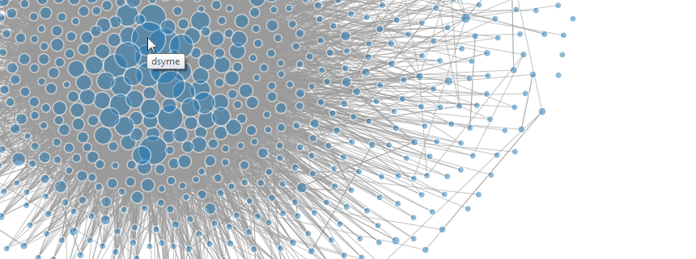

Have you ever wondered who you should follow on Twitter to get more interesting
F# content? 
Recently I've written a chapter on social network analysis for the new 
[F# Deep Dives](http://www.manning.com/petricek2/) book. The chapter shows
how to download data on social connections from Twitter and how to do some
exploratory data analysis, such as finding accounts that people
find worth following. 

I worked with a network around the 
[F# Software Foundation's](http://fsharp.org) account. What
emerged is a nice picture of how F# community looks on Twitter and which 
users are the most central to the network. 
Since the results are quite interesting, I'd like to share them with wider F# community.

<!--more-->

Network around @fsharporg
---------------------------------

For the chapter, I wanted to analyze a network of F# users that are active 
on Twitter. A good starting point is the account of the F# Software Foundation. 
I think we can reasonably assume that followers of this account are generally 
people interested in F#. This group definitely doesn't cover
all the Fsharpers on Twitter but it probably includes a significant 
part of the active community. 

The network that I analyzed is centred around the 
[@fsharporg](http://www.twitter.com/fsharporg) account. Nodes in the network are
users that either follow @fsharporg or who are being followed by @fsharporg. 
Links between nodes represent the 'follow' relationships. 
If account A follows
account B, there'll be a link from A to B in the Twitter network. The actual @fsharporg
node is not included because it is connected to every other node
so it doesn't add any new information.

I downloaded the data from Twitter using the F# Twitter type provider from
[F# Data Toolbox](http://fsprojects.github.io/FSharp.Data.Toolbox/).
The network as described contains 1109 nodes and 14412 links. 
This is not an up-to-date number of nodes because I downloaded the data back in February
and the number of followers 
has grown since. Number of links is also larger in reality. Some of the accounts 
that follow @fsharporg keep their 
friends and followers private and their links don't appear in the network. 

Number of followers
-----------------------------------
First thing that we can do with the data is to find how many followers each user has 
within the F# community. Note that it is not the same as total number of followers because
we're working only with the users linked to @fsharporg.  

In terminology of network science, number of followers corresponds to in-degree of a node in a graph. 
In-degree is simply the number of links (arrows) pointing towards a node.

Here I extracted the top 20 Twitter accounts based on number of 
their F# followers:

 Rank | Twitter screen name | Number of followers 
------|---------------------|------------------------
1     | dsyme               | 644
2     | tomaspetricek 			| 556
3     | migueldeicaza 			| 545
4     | VisualFSharp 				| 483
5     | c4fsharp 						| 457
6     | ptrelford 					| 348
7     | rickasaurus 				| 337
8     | jonharrop 					| 264
9     | reddit_fsharp 			| 262
10    | sforkmann						| 257
11|dmohl|254
12|sergey_tihon|249
13|brandewinder|233
14|rachelreese|201
15|granicz|199
16|ttliu2000|194
17|ovatsus|187
18|kitlovesfsharp|174
19|theburningmonk|173
20|foxyjackfox|155

The first position belongs to Don Syme,
designer and architect of F# itself. Don seems to be doing a good job promoting F#!
It is interesting that in the third place we have Miguel de Icaza who is not 
directly linked with F#. The fact that he features so prominently in the 
network shows that people connected to 
@fsharporg on Twitter are interested in Mono and open source development. 
It is also a nice validation that the number of 
followers corresponds to importance to some degree. 
The full list of accounts ordered by number of their F# followers is available 
as a 
[csv file](https://github.com/evelinag/Social-network-analysis/blob/master/data/indegrees.csv).

Number of followers is a straightforward measure of importance but it doesn't take some finer aspects
into account. For example, having a few very important followers is making
an account immediately more influential. Some of this
intuition is captured in a different centrality metric, the PageRank.

Centrality with PageRank
---------------------------
PageRank is a popular measure of node importance in general graphs. 
The name 'PageRank' originally comes from Google who uses it as a part of their 
website ranking algorithm. It uses 
the structure of World Wide Web to estimate relative importance
and authority of each website.
The method itself is based on probability theory but I don't want to
go into details here (you can find them in the chapter).  

The same measure works for estimating centrality in other types of graphs, such as social networks.
When we look at PageRank applied to Twitter network, there are three aspects that affect centrality
of an account:

* number of followers
* centrality of followers
* quality of links from followers

Quality of links is based on the number of accounts that a node follows. 
For example, Alice follows only 10 accounts on Twitter and her friend Bob follows 1000 accounts.
Each account that Alice follows receives more weight from her than from Bob because
Bob distributes his interest among many more accounts. 

PageRank combines these aspects to put together relative importance of each follower. 
How different is the list of top 20 F# accounts based on PageRank?

 Rank | Twitter screen name | PageRank 
------|---------------------|------------------------
1|migueldeicaza|0.03313
2|dsyme|0.03278
3|tomaspetricek|0.02776
4|LincolnAtkinson|0.02199
5|VisualFSharp|0.02023
6|c4fsharp|0.01972
7|rickasaurus|0.01919
8|ptrelford|0.01810
9|1tgr|0.01652
10|sforkmann|0.01497
11|brandewinder|0.01391
12|jonharrop|0.01370
13|dmohl|0.01337
14|rachelreese|0.01176
15|granicz|0.01164
16|sergey_tihon|0.01101
17|reddit_fsharp|0.01096
18|ovatsus|0.00995
19|ttliu2000|0.00924
20|foxyjackfox|0.00910

Now we have Miguel de Icaza in the first place and Don Syme in the second! It seems
that PageRank does indeed capture some extra information. The full list of accounts ordered by their PageRank is available as a 
[csv file](https://github.com/evelinag/Social-network-analysis/blob/master/data/pagerank.csv).

Some accounts seem to be quite underrated in terms of number of their followers.
Here is a comparison of how the ordering changes between the two measures of
centrality:

Visualization
----------------------------------

I've also visualized the F# Twitter network using [D3.js](http://d3js.org/). 
If you click on the image below, you'll see the full F# network in svg format. 
When you hover your mouse over a node in the visualization, you should see its Twitter name.
Each node
is also scaled proportionally to its PageRank score. The larger the node, the more important 
it is in the network.

From the picture it is clear that the graph is well connected with a dense centre. 
There are no clear sub-communities. A structure like this is fairly typical for so-called
scale-free networks. These are characterized by a few large hubs that are densely connected with many
other less connected nodes. Another example of a network with this type of structure is the internet.

An interesting feature of scale-free networks is that they are robust with respect to random node 
deletion. 
I suppose that is good news for F# on Twitter because the network won't
fall apart easily if individual users leave. 

Network analysis in F#
------------------------------------------

I hope you enjoyed getting some information on how F# Twitter community looks and who are
its key figures. 
The whole analysis was done in F# and the source code for the chapter is available 
from [GitHub](https://github.com/evelinag/Social-network-analysis).
I think F# is a great tool for this kind of analysis because it combines all the steps of the process,
from downloading and extracting the data to doing computational analysis. 
If you're interested in details on how to analyze social networks with F#, they will appear 
in Chapter 5 of [F# Deep Dives](http://www.manning.com/petricek2/). 

#### Links

* [Users ordered by number of their followers](https://github.com/evelinag/Social-network-analysis/blob/master/data/indegrees.csv)
* [Users ordered by PageRank](https://github.com/evelinag/Social-network-analysis/blob/master/data/pagerank.csv)
* [Source code for the chapter](https://github.com/evelinag/Social-network-analysis)
* [F# Deep Dives](http://www.manning.com/petricek2/)
* [F# Data Toolbox](http://fsprojects.github.io/FSharp.Data.Toolbox/) with library for Twitter data access

