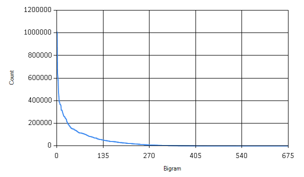
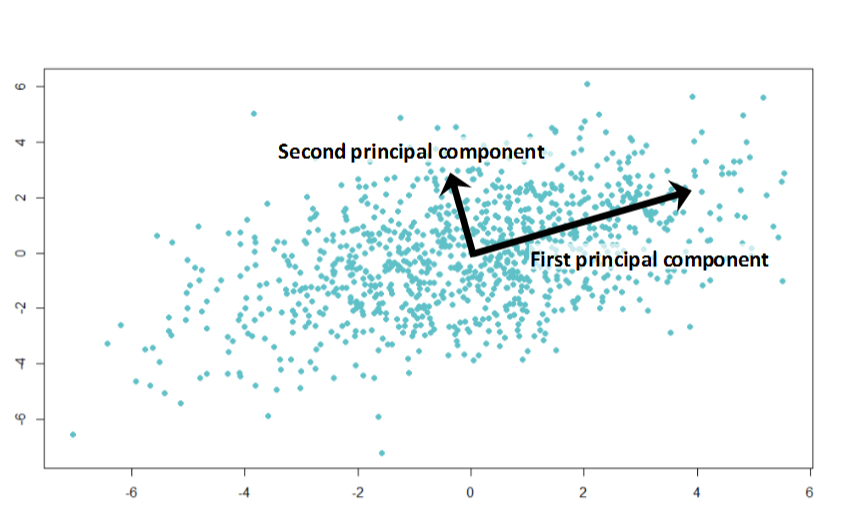
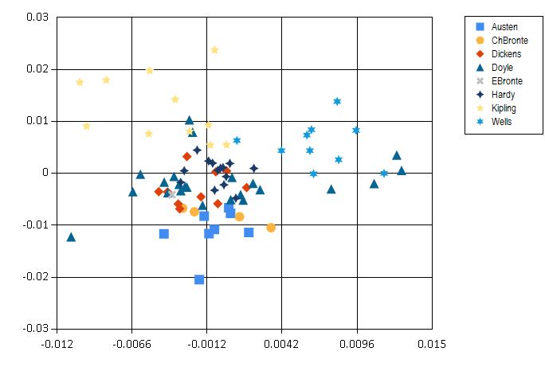
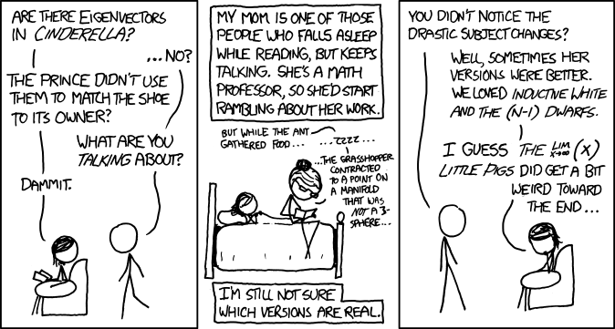

This blog post marks day 15 of the amazing [F# Advent Calendar](https://sergeytihon.wordpress.com/2014/11/24/f-advent-calendar-in-english-2014/). 
Christmas is getting closer - soon we will have time to 
relax and perhaps read a nice book.
Do you know who wrote the classic Christmas story, 
['A Christmas Carol'](http://en.wikipedia.org/wiki/A_Christmas_Carol)?
All sources claim it was Charles Dickens, but how can we be sure? I'll look
at how this book compares to other books he wrote in terms of the language 
used in the books. I'll also analyse other classic works of literature from
the Victorian and Edwardian era and look at similarity of their
language. In the end, I'll try to find out if it really was Charles Dickens 
who wrote 'A Christmas Carol'. 

<!-- more -->

<figure class="image container is-fluid">

</figure>

This is a simple data analysis project which compares and visualises
some publicly available classic English books. General approach to analysis
of complex data that are hard to compare directly is to describe the
data using a set of characteristic features. 
For my literature analysis, I'll be using
frequencies of pairs of letters, called bigrams. These simple features
capture some characteristics of the language that different authors use. 

I compute such features for a set of classic books in English. Then
I use Principal Component Analysis (PCA) to find how different is the language
of different authors. I also use the PCA projection to visualise the 
data and visually explore their similarity. 

Finally, I use the k nearest neighbours classification method to see
if it really was Charles Dickens who wrote 'A Christmas Carol'.
I will be using F# through this post, source code is available
from my [GitHub](https://github.com/evelinag/Projects/tree/master/PCA).

Parsing books from Project Gutenberg
---------------------------------------------

For this project, I downloaded 82 books in total from 8 classic English authors:

* Jane Austen
* Charlotte Bronte
* Charles Dickens
* Arthur C. Doyle
* Emily Bronte
* Thomas Hardy
* Rudyard Kipling
* H. G. Wells
 
All the books I used are in the public domain, available from
[Project Gutenberg](https://www.gutenberg.org/). The books I'm using
in my little project are also available on my [GitHub](https://github.com/evelinag/Projects/tree/master/PCA)
together with all the source code.

The first and most annoying step of any data analysis is to clean the data. 
Every book from project Gutenberg comes with licence agreement at the 
beginning and the full licence text at the end. The structure of these
sections is fairly standardised, which makes it fairly easy to strip each book 
off these parts. The preamble in the beginning also contains book title
which we can extract.

In F#, it's straightforward to load text of each book separated into lines 
and then look for the specific lines that mark the beginning and end of each book.
The following functions identify the main body of text, standardise it to
lower case and and also find the book title.


open System
open System.IO

type BookPart = | Start | End

// This function uses specific format of books from Project Gutenberg
let isBookPart part (line:string) =
	let keyword = 
		match part with
		| Start -> "START"
		| End -> "END"
	(line.Contains (keyword + " OF THIS PROJECT GUTENBERG EBOOK"))
	|| (line.Contains (keyword + " OF THE PROJECT GUTENBERG EBOOK"))

let bookStarted line = isBookPart Start line
let bookFinished line = isBookPart End line

// Process lines of text in a book, skip license agreements
// and standardise letters
let cleanText (lines: string[]) =
	lines
	|> Seq.skipWhile (fun str -> not (bookStarted str))
	|> Seq.takeWhile (fun str -> not (bookFinished str))
	|> String.concat " "
	|> Seq.map (fun c -> 
		if Char.IsLetter c then Char.ToLowerInvariant c
		else ' ')

// Extract title of a book from the preamble
let getBookTitle (lines: string[]) = 
	lines.[0..15]
	|> Array.pick (fun str -> 
		if str.StartsWith "Title:" then 
			Some(str.[6..].Trim() )
		else None)    
  
			
Now we have all the ingredients to pre-process each book:


let loadBook filename =
	let fullContents = File.ReadAllLines filename
	let title = getBookTitle fullContents
	let text = cleanText fullContents
	title, text
		
	    
Representing text with bigrams
-------------------------------------------------

Bigrams are simply pairs of letters. They are used in 
various language modelling algorithms. For example, different
languages use bigrams with frequencies that are characteristic for each language.
This property makes it possible to 
use bigrams for simple language identification. 

Generally, other symbols than letters can be included into bigrams as well. 
Pairs of letters and spaces show what are common characters at the beginning
and the end of words. Here I define all possible bigrams that I'm interested in: 
this piece of code generates simply all possible pairs of letters.


let alphabet = "abcdefghijklmnopqrstuvwxyz"
let letterPairs =
	[| for a in alphabet do 
		for b in alphabet -> [|a; b|] |]


Finally, we can write a function that turns a book into a sequence
of bigram counts. When we have sequence of letters in a book, it is 
very easy to split it into all consequtive pairs of letters using
`Seq.windowed` (or `Seq.pairwise`) and then count occurences of each pair with 
`Seq.countBy`. If we wanted to count number of trigrams (triples
of letters), we would only need to change the window size in `Seq.windowed`.


let rawBigrams =
	text
	|> Seq.windowed 2
	|> Seq.countBy id
		

The following is the complete function which processes a whole book and returns bigram
counts in a standard order defined by `letterPairs`.


// Extract title and bigram counts from a specific book
let bookBigrams filename =
	let title, text = loadBook filename

	let rawBigrams =
		text
		|> Seq.windowed 2
		|> Seq.countBy id
		|> dict

	let bigramCountVector =
		letterPairs 
		|> Array.map (fun pair -> 
			if rawBigrams.ContainsKey pair then rawBigrams.[pair]
			else 0)

	title, bigramCountVector


Now we can find which bigrams are the most frequent in each book.


let filename = "C:/Temp/books/Dickens/pg46.txt"
let title, data = bookBigrams filename

// most common bigrams
Array.zip letterPairs data
|> Array.sortBy (fun x -> - snd x)
|> Seq.take 3


In 'A Christmas Carol', the most common bigram is 'th' followed by 'he'. 
It seems that the most frequent word in the book is 'the'! 


val it : seq<char [] * int> =
seq [([|'t'; 'h'|], 3650); ([|'h'; 'e'|], 3532); ([|'i'; 'n'|], 2155)]
	

The following block of code processes all books in my little data set.
Each book is located in a directory named after its author. To speed it up,
I run this step in parallel using F# `PSeq`.
Computing bigrams from all the books is still the most time-consuming step
of the analysis. For this reason, I save the results into a `csv` file
so that I don't have to re-run the computation often. You can find the
resulting `csv` file in the source-code. 


#r "packages/FSharp.Collections.ParallelSeq/lib/net40/FSharp.Collections.ParallelSeq.dll"
open FSharp.Collections.ParallelSeq

let booksDir = "C:/Temp/books"
let authorDirs = Directory.GetDirectories(booksDir)

// Compute bigram counts for all books
let authorBigrams =
	authorDirs
	|> Array.map (fun d -> 
		Directory.GetFiles(d)
		|> PSeq.map (fun file -> bookBigrams file)
		|> PSeq.toArray)

(*[omit:(Save computed results into a csv file.)]*)
let header = 
	"Author,Book," 
	+ (letterPairs 
		|> Array.map (fun cs -> 
			cs |> Array.map string |> String.concat "") 
		|> String.concat ",")

let lines = 
	Array.zip authorDirs authorBigrams
	|> Array.map (fun (d, data) ->
		let author = Path.GetFileName(d)
		data 
		|> Array.map (fun (b, xs) ->
			author + "," + b
			+ "," + (xs |> Array.map string |> String.concat ","))
		)
	|> Array.concat

let file = "C:/Temp/books/bigramValues.csv"
File.WriteAllLines(file, Array.append [|header|] lines)
(*[/omit]*)


Data preprocessing
--------------------------
Although now we have counts of bigrams in all the books, we are
still not finished with the clean-up! There are many bigrams that
are only rarely appearing in standard English text, such as 'qb' or 'bg'. 
These rare bigrams behave like noise in our data - they might come 
for example from some unusual name used just by one author etc. 

The graph shows how many times each bigram appears in the books.
We can safely discard many of the bigrams that are only rarely used. 


// read csv file and extract data
(*[omit:(Read csv file and extract data.)]*)
#r "packages/MathNet.Numerics/lib/net40/MathNet.Numerics.dll"
#r "packages/MathNet.Numerics.FSharp/lib/net40/MathNet.Numerics.FSharp.dll"
#load "packages/FSharp.Charting.0.90.9/FSharp.Charting.fsx"

open System
open System.IO
open FSharp.Charting

// Load the full dataset
let dataFile = "C:/Temp/books/bigramValues.csv"

let authors, titles, fullData = 
	(dataFile |> File.ReadAllLines).[1..]
	|> Array.map (fun line -> 
		let fullLine = line.Split [|','|]
		fullLine.[0], fullLine.[1], 
		fullLine.[2..] |> Array.map (fun x -> Double.Parse x))
	|> Array.unzip3
(*[/omit]*)

// Sort bigrams by frequency
let sortedBigrams = 
	[| for idx in 0..letterPairs.Length - 1 ->
		let sum = fullData |> Array.sumBy (fun xs -> xs.[idx])
		idx, sum |]
	|> Array.sortBy (fun (idx, sum) -> -sum)
	|> Array.map fst

// How many bigrams to keep
let bigramCount = 400
let mostUsedBigrams = sortedBigrams.[0..bigramCount-1] |> set

let chooseBigrams bigramValues =
	bigramValues 
	|> Array.mapi (fun i x -> 
		if mostUsedBigrams.Contains i then Some(x) else None) 
	|> Array.choose id    


Here I'm keeping only the 400 most frequent bigrams. The last step in
preprocessing the data is to normalize the total counts for each
bigram to relative frequencies within each document. 


// Normalize counts to relative frequencies
let normalize (xs: float[]) =
	let total = Array.sum xs
	xs |> Array.map (fun x -> x/total)


Finally, the data are prepared for the mathematical analysis. 
The following piece of code turns the data into a matrix.		


open MathNet.Numerics
open MathNet.Numerics.LinearAlgebra
open MathNet.Numerics.LinearAlgebra.Double		 

let dataMatrix = 
	fullData
	|> Array.map (fun xs -> chooseBigrams xs)    
	|> Array.map (fun xs -> normalize xs)
	|> DenseMatrix.ofColumnArrays	
		

Principal Component Analysis
--------------------------------------

Principal Component Analysis (PCA) is a mathematical method 
for data transformation. It is most commonly used 
for dimensionality reduction. Right now we have 400-dimensional 
dataset, i.e. separate dimension for each bigram. It is hard to
visualise such data to get an overview of relations between individual
books and authors. PCA gives us a method to project data onto 
a lower-dimensional hyperspace while preserving most differences.
In the projection, data points that are far in the original data 
should stay distant from each other and vice versa.

PCA can be mathematically derived as a projection into a lower-dimensional
hyperspace which minimizes the sum of squared differences between
the original data point and its low-dimensional projection. What it does
in simple terms is that it finds directions of largest variance in
the data. 

In the illustration above, the first principal component shows the
direction of the largest variance in the data. The second principal component
points to a direction of smaller variance.
We can use principal component directions as a new coordinate system.
For dimensionality reduction, we typically discard directions (dimensions) that account
only for small variance in the data - these dimensions
are not very informative (because they don't vary between data points), 
or account for noise in the data. 
 
Before the actual Principal Component Analysis, we have to 
center data such that their mean is at zero.


// Mean vector of the whole dataset
let center = 
	let n = dataMatrix.ColumnCount |> float
	dataMatrix.RowSums() / n

// Normalize data to zero mean
let centeredMatrix = 
	let sumMatrix = Array.init dataMatrix.ColumnCount (fun _ -> center)
						|> DenseMatrix.OfColumnVectors
	dataMatrix - sumMatrix
		

The standard algorithm for computing principal component
analysis is very simple, principal components are eigenvectors
of data covariance matrix. There is a function for eigenvalue decomposition
in `Math.NET Numerics`, which makes it straightforward to compute
in F#. First we need to calculate the covariance matrix 
of our centered data. 
	
$$
S = \frac{1}{N-1} X X^T
$$

$X$ is the data matrix and $S$ is the resulting covariance. 
I will work with a scaled covariance matrix $ X X^T $ which has the
same eigenvectors as the matrix $ S $.


// Compute covariance matrix
let covarianceMatrix = centeredMatrix * centeredMatrix.Transpose()

// Eigenvalue decomposition
let evd = covarianceMatrix.Evd()


In variable `evd` we now have an object returned by `Math.NET` 
which contains eigenvectors and eigenvalues of the covariance matrix.
Directions of the largest variance are eigenvectors that correspond
to largest eigenvalues. Since eigenvalues are ordered from smallest to 
the largest, we have to pick eigenvectors from the end of their
matrix. The following function returns a matrix formed of 
$d$ most important eigenvectors.


let eigenvectors d = 
	let m = evd.EigenVectors
	m.[0..m.RowCount-1, m.ColumnCount-d..m.ColumnCount-1]


With eigenvectors ready, we can compute projection of 
our data set onto a specified number of dimensions $d$. 
	
$$
\tilde{X} = E_d^T \, X
$$

$\tilde{X}$ is an approximation of our original data matrix $X$ in $d$ dimensions
and $E_d$ is the eigenvector matrix formed of $d$ most important eigenvectors. 
The following function takes number of dimensions as an 
input and returns projection of the data into the specified number
of dimensions.


let projection d = (eigenvectors d).Transpose() * centeredMatrix


Similarity of classic works of literature
------------------------------------------

Finally we can look at the classic books and how do they compare
in terms of language that they use. The plot below shows a projection
onto two most significant principal components. 

The resulting image is quite interesting: H. G. Wells and Rudyard Kipling
are well separated from the others. This might be the result of
using foreign and exotic names in their books. On the other hand, 
Arthur Conan Doyle
seems to be all over the place - perhaps Sherlock Holmes investigated
cases in many different environments. 
Another interesting thing is that women authors, Jane Austen and 
the Bronte sisters are all grouped together in the bottom half of the plot. 

Note that this visualisation is very simplifying - it summarizes
400-dimensional vectors into just two dimensions. Still, it seems
to reveal some interesting regularities in our data. 

So who wrote 'A Christmas Carol'?
---------------------------------------------

Let's turn to the key question of this blog post - was it indeed Charles
Dickens who wrote the book `A Christmas Carol`? For this, I will
use a simple classification algorithm, k nearest neighbours. The algorithm
itself is very simple: it computes distances of our data point of interest
(the book) to all other data points (other books). Then it selects $k$
nearest items. The author of the Christmas Carol book will be the author who wrote most
of the books that are closests. 

This classification algorithm works very well when combined with PCA. 
In its standard form, k nearest neighbours suffers from the so-called 
[curse of dimensionality](http://en.wikipedia.org/wiki/Curse_of_dimensionality#Nearest_neighbor_search).
When computing distances in very high-dimensional spaces, the result
is highly sensitive to noise and irrelevant dimensions. By preprocessing
data with PCA and projecting it into a lower-dimensional space, 
k nearest neighbours turns into a much more robust algorithm. 

For our analysis of 'A Christmas Carol', I projected the books' bigram 
frequencies into 20 dimensions. This captures more information about
the data than the 2D visualisation. 


let projectedData = projection 20
let christmasCarol = projectedData.Column(christmasCarolIdx)


To "identify" the author, I will look at only three nearest neighbours
based on Euclidean distance: 


let kNearest k = 
	[| for idx, v in projectedData.EnumerateColumnsIndexed() do
		if idx <> christmasCarolIdx then
			let distance = (v - christmasCarol)*(v - christmasCarol)
			yield titles.[idx], distance |]
	|> Seq.sortBy snd
	|> Seq.take k
	|> Array.ofSeq

kNearest 3
	

What is the conclusion? 


val it : (string * float) [] =
	[|("Oliver Twist", 0.0001679233456);
	("A Tale of Two Cities", 0.0001827125101);
	("The Sign of the Four", 0.0002067513054)|]


Well, it seems it must have been Charles Dickens after all! Two out of three
closest books were written by him.
This shows that our simple PCA analysis on bigrams
was able to capture some characteristics of language used by different
authors. 

Summary
-------------------------------

In this Christmas themed blog post, I went through the task of
identifying author of a book based on features of language he used
in his work. Although this is a simple toy problem, the general principles 
apply to other problems as well. 
Principal component analysis is an incredibly useful tool for visualisation
of complex high-dimensional data. Together with k nearest neighbours 
algorithm it can be used for easy exploration for supervised
learning problems. And it might even help you in fairy tales!

[Source: xkcd.com](http://xkcd.com/872/)

Happy holidays!
