Fans of different programming languages always argue about benefits of their language
of choice. It is difficult to use objective criteria in a debate like this. Terms like 
'clarity' or 'maintainability' are too vague and subjective. What if we used some tools from network 
science to compare projects written in different languages?

In this blog post I use network analysis to investigate how complex dependency graphs are and
if they differ between C# and F#.
It turns out that F# and C# 
dependency networks have quite different structures and use 
different local network patterns.
For example, I'll describe specific types of cyclic dependencies 
that frequently appear only in C# projects. 

<!-- more -->

<figure class="image container is-fluid">
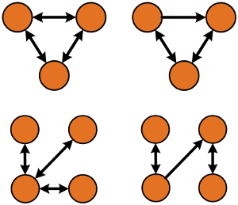
</figure>

This blog post is an addition to an excellent article by Scott Wlaschin on 
modularity and cyclic dependencies in real-world F# and C# projects
[Cycles and modularity in the wild](http://fsharpforfunandprofit.com/posts/cycles-and-modularity-in-the-wild/).
I wanted to look at the same data that Scott extracted in his 
article but from network analysis perspective. 

Dependency networks
-------------------------------

For my analysis, I extracted dependency networks from 40 different projects, half of
them written in C# and half of them in F#. All the networks come from 
compiled assemblies that can be downloaded through NuGet. 
I used similar method as Scott for my analysis. If you want more details, head
over to [F# for fun and profit](http://fsharpforfunandprofit.com/posts/cycles-and-modularity-in-the-wild/)
for a more detailed description. I'll give just a brief overview here.

#### Structure of a dependency network

A dependency network is formed by nodes and oriented links between them.

Nodes in the dependency network are formed by

- Classes in C#
- Modules in F#

Compiler turns F# modules into static classes so the two definitions should
be roughly comparable, at least on the CIL level. 
Both types of nodes represent only top-level classes
and modules, nested types are incorporated into their parent class or module.
The networks analyzed in this blog post contain all the classes and modules from
each project, not just the public ones.

Links between the nodes represent dependencies. 
There is a link from A to B in the network if:

- Class B inherits from class A or implements interface A.
- Function in B calls a function or method from A.
- Field, property, method or function in B references A
as a parameter or as a return type.

Note that I switched direction of dependency arrows
in the network compared to the original article at 
[F# for fun and profit](http://fsharpforfunandprofit.com/posts/cycles-and-modularity-in-the-wild/).
Now links represent the direction in which information is passed between
nodes. This definition corresponds more to the logic of information flow in a program. 
For example if there is a bug in a function, it will propagate along the dependency
arrows into all nodes that call the function. 

#### Projects under the spotlight

I expanded the list of analysed projects compared to the original analysis 
at [F# for fun and profit](http://fsharpforfunandprofit.com/posts/cycles-and-modularity-in-the-wild/).
Again, the projects are not directly comparable in general. 
I hope that by using more projects, data get averaged and we can
get a bigger picture out of them. 
The results are still biased from the small sample size though. 

Here are the 40 projects (individual dlls) that got included 
into the analysis (in no particular order):

###### C# projects:
Antlr, AutoMapper, Castle, elmah, EntityFramework, FParsecCS, log4net, MathNet.Numerics, SignalR, Bcl.Runtime, Owin, Cecil, Moq, Nancy, Newtonsoft.Json, Nuget, NUnit, SpecFlow, xunit, YamlDotNet

###### F# projects:
canopy, Deedle, Fake, Foq, FParsecFS, FsCheck, FSharp.Compiler.Service, FSharp.Core, FSharp.Data, FSharp.Data.Twitter, FSharpx, FsPowerPack, FsSql, FsUnit, FsYaml, Storm, TickSpec, WebSharper, WebSharper.Core, WebSharper.Html

Network statistics
-------------------------------

The networks extracted from compiled project dlls have very different sizes.
The following chart shows the number of nodes (classes or modules) and number 
of dependencies in each project. The axes in the figure are logarithmic so that we
can put data with different scales into one picture.

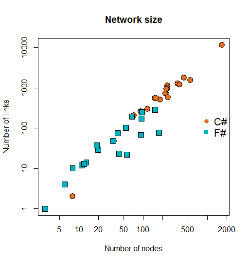

Projects written in F# seem to be generally smaller. On the other hand, C# projects tend 
to be larger both in the number of nodes and number of dependencies. 
It is interesting that the plot looks approximately like a straight line. This indicates
a power law relation between the number of nodes and links both in F# and C# projects.  

Next question we might ask is how complex are the networks? One measure of 
complexity in code depedendency networks might be how many dependencies are chained
together in the graph. Long chains of dependencies increase complexity of code.
For example, bugs that get propagated through a long dependency path might affect
a large part of the whole project. 
A standard measure for this is the network diameter. It is computed by looking at shortest
paths between all possible pairs of nodes in a network. 
Diameter is defined as the length of the longest
of these paths. For diameters in C# and F# projects we get these box plots:

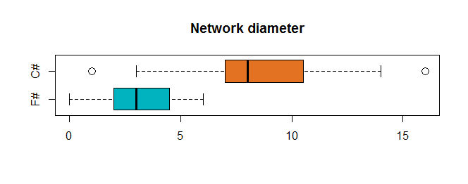

Diameter of analyzed C# projects is on average more than double the diameter 
of F# projects. Diameters are actually roughly proportional to the number of nodes and 
links in each network. Because C# has larger networks, diameters expand as well. 

One aspect where F# and C# projects differ dramatically is the number of 
isolated nodes. These represent standalone modules or classes that do not have any
dependency within the project. Here is a box plot showing the proportion of 
 standalone nodes.

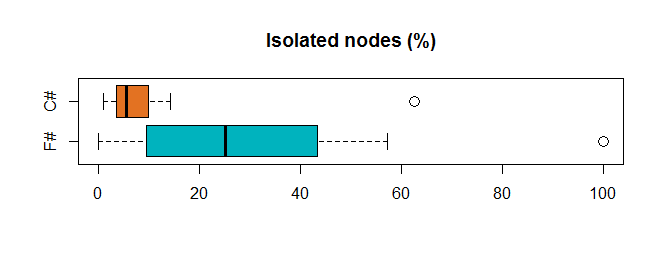

Isolated nodes appear much more frequently
in F# projects than in C# projects. This is probably an effect of different 
programming paradigms. Object-oriented language like C# might require
the programmer to introduce more dependencies into the code. As a result,
functional F# has cleaner modularity than C# on average. 

Below are images of networks from two different projects as an example. 
There is `Yaml.NET` on the left and `FSharp.Core` on the right. The two projects
are not comparable in terms of their scope. However, their networks have 
roughly the same number of nodes and similar diameter. 

`FSharp.Core` has more isolated nodes that do not have any dependencies
within the project which seems to be typical for F# projects.
The densely connected core of the project is much smaller than in C#. 
The two networks are meant just as an illustration of typical features
of C# and F# dependency networks. 

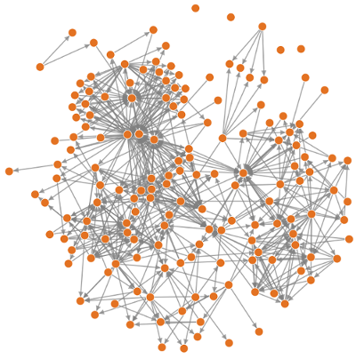

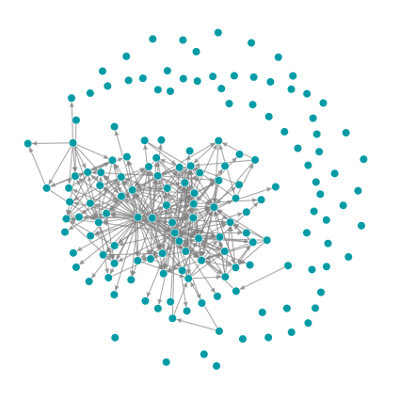

Here are the detailed numbers for the analyzed projects:

#### C# code statistics

<table>
<thead>
<tr>
<th>Project</th>
<th align="center">Code size</th>
<th align="center">Number of nodes</th>
<th align="center">Number of links</th>
<th align="center">Isolated nodes</th>
<th align="center">Diameter</th>
</tr>
</thead>

<tbody>
<tr>
<td>Antlr</td>
<td align="center">34344</td>
<td align="center">91</td>
<td align="center">257</td>
<td align="center">8.8 %</td>
<td align="center">5</td>
</tr>

<tr>
<td>AutoMapper</td>
<td align="center">34793</td>
<td align="center">152</td>
<td align="center">549</td>
<td align="center">5.3 %</td>
<td align="center">8</td>
</tr>

<tr>
<td>Castle</td>
<td align="center">112538</td>
<td align="center">430</td>
<td align="center">1766</td>
<td align="center">5.6 %</td>
<td align="center">8</td>
</tr>

<tr>
<td>elmah</td>
<td align="center">43728</td>
<td align="center">116</td>
<td align="center">300</td>
<td align="center">7.8 %</td>
<td align="center">5</td>
</tr>

<tr>
<td>EntityFramework</td>
<td align="center">1144189</td>
<td align="center">1679</td>
<td align="center">11671</td>
<td align="center">4.7 %</td>
<td align="center">16</td>
</tr>

<tr>
<td>FParsecCS</td>
<td align="center">32230</td>
<td align="center">35</td>
<td align="center">48</td>
<td align="center">14.3 %</td>
<td align="center">3</td>
</tr>

<tr>
<td>log4net</td>
<td align="center">102651</td>
<td align="center">227</td>
<td align="center">746</td>
<td align="center">0.9 %</td>
<td align="center">10</td>
</tr>

<tr>
<td>MathNet.Numerics</td>
<td align="center">492095</td>
<td align="center">342</td>
<td align="center">1285</td>
<td align="center">5.6 %</td>
<td align="center">8</td>
</tr>

<tr>
<td>SignalR</td>
<td align="center">63690</td>
<td align="center">221</td>
<td align="center">735</td>
<td align="center">6.8 %</td>
<td align="center">11</td>
</tr>

<tr>
<td>Bcl.Runtime</td>
<td align="center">73</td>
<td align="center">8</td>
<td align="center">2</td>
<td align="center">62.5 %</td>
<td align="center">1</td>
</tr>

<tr>
<td>Owin</td>
<td align="center">13376</td>
<td align="center">55</td>
<td align="center">98</td>
<td align="center">10.9 %</td>
<td align="center">7</td>
</tr>

<tr>
<td>Cecil</td>
<td align="center">100650</td>
<td align="center">240</td>
<td align="center">1145</td>
<td align="center">5.0 %</td>
<td align="center">8</td>
</tr>

<tr>
<td>Moq</td>
<td align="center">158417</td>
<td align="center">541</td>
<td align="center">1536</td>
<td align="center">11.1 %</td>
<td align="center">14</td>
</tr>

<tr>
<td>Nancy</td>
<td align="center">130818</td>
<td align="center">369</td>
<td align="center">1205</td>
<td align="center">5.4 %</td>
<td align="center">12</td>
</tr>

<tr>
<td>Newtonsoft.Json</td>
<td align="center">157716</td>
<td align="center">237</td>
<td align="center">1005</td>
<td align="center">4.6 %</td>
<td align="center">13</td>
</tr>

<tr>
<td>Nuget</td>
<td align="center">101586</td>
<td align="center">229</td>
<td align="center">943</td>
<td align="center">2.2 %</td>
<td align="center">10</td>
</tr>

<tr>
<td>NUnit</td>
<td align="center">45873</td>
<td align="center">183</td>
<td align="center">505</td>
<td align="center">14.2 %</td>
<td align="center">7</td>
</tr>

<tr>
<td>SpecFlow</td>
<td align="center">41187</td>
<td align="center">242</td>
<td align="center">578</td>
<td align="center">2.5 %</td>
<td align="center">7</td>
</tr>

<tr>
<td>xunit</td>
<td align="center">14590</td>
<td align="center">72</td>
<td align="center">209</td>
<td align="center">1.4 %</td>
<td align="center">7</td>
</tr>

<tr>
<td>YamlDotNet</td>
<td align="center">42372</td>
<td align="center">161</td>
<td align="center">550</td>
<td align="center">2.5 %</td>
<td align="center">7</td>
</tr>
</tbody>
</table>

 

<h4> F# code statistics </h4>

<table>
<thead>
<tr class="header">
<th>
Project
</th>
<th align="center">
Code size
</th>
<th align="center">
Number of nodes
</th>
<th align="center">
Number of links
</th>
<th align="center">
Isolated nodes
</th>
<th align="center">
Diameter
</th>
</tr>
</thead>
<tbody>
<tr class="odd">
<td>
canopy
</td>
<td align="center">
23630
</td>
<td align="center">
11
</td>
<td align="center">
12
</td>
<td align="center">
27.3 %
</td>
<td align="center">
2
</td>
</tr>
<tr class="even">
<td>
Deedle
</td>
<td align="center">
122918
</td>
<td align="center">
95
</td>
<td align="center">
249
</td>
<td align="center">
18.9 %
</td>
<td align="center">
5
</td>
</tr>
<tr class="odd">
<td>
Fake
</td>
<td align="center">
1395
</td>
<td align="center">
3
</td>
<td align="center">
1
</td>
<td align="center">
33.3 %
</td>
<td align="center">
1
</td>
</tr>
<tr class="even">
<td>
Foq
</td>
<td align="center">
38532
</td>
<td align="center">
40
</td>
<td align="center">
75
</td>
<td align="center">
5.0 %
</td>
<td align="center">
3
</td>
</tr>
<tr class="odd">
<td>
FParsecFS
</td>
<td align="center">
45946
</td>
<td align="center">
6
</td>
<td align="center">
4
</td>
<td align="center">
33.3 %
</td>
<td align="center">
2
</td>
</tr>
<tr class="even">
<td>
FsCheck
</td>
<td align="center">
76418
</td>
<td align="center">
54
</td>
<td align="center">
103
</td>
<td align="center">
16.7 %
</td>
<td align="center">
5
</td>
</tr>
<tr class="odd">
<td>
FSharp.Compiler.Service
</td>
<td align="center">
110523
</td>
<td align="center">
42
</td>
<td align="center">
23
</td>
<td align="center">
50.0 %
</td>
<td align="center">
2
</td>
</tr>
<tr class="even">
<td>
FSharp.Core
</td>
<td align="center">
206348
</td>
<td align="center">
154
</td>
<td align="center">
287
</td>
<td align="center">
40.3 %
</td>
<td align="center">
6
</td>
</tr>
<tr class="odd">
<td>
FSharp.Data
</td>
<td align="center">
135001
</td>
<td align="center">
94
</td>
<td align="center">
173
</td>
<td align="center">
8.5 %
</td>
<td align="center">
6
</td>
</tr>
<tr class="even">
<td>
FSharp.Data.Twitter
</td>
<td align="center">
10372
</td>
<td align="center">
20
</td>
<td align="center">
29
</td>
<td align="center">
25.0 %
</td>
<td align="center">
3
</td>
</tr>
<tr class="odd">
<td>
FSharpx
</td>
<td align="center">
290577
</td>
<td align="center">
175
</td>
<td align="center">
77
</td>
<td align="center">
56.0 %
</td>
<td align="center">
2
</td>
</tr>
<tr class="even">
<td>
FsPowerPack
</td>
<td align="center">
102878
</td>
<td align="center">
93
</td>
<td align="center">
68
</td>
<td align="center">
46.2 %
</td>
<td align="center">
4
</td>
</tr>
<tr class="odd">
<td>
FsSql
</td>
<td align="center">
15311
</td>
<td align="center">
13
</td>
<td align="center">
14
</td>
<td align="center">
0.0 %
</td>
<td align="center">
4
</td>
</tr>
<tr class="even">
<td>
FsUnit
</td>
<td align="center">
1580
</td>
<td align="center">
2
</td>
<td align="center">
0
</td>
<td align="center">
100.0 %
</td>
<td align="center">
0
</td>
</tr>
<tr class="odd">
<td>
FsYaml
</td>
<td align="center">
14573
</td>
<td align="center">
8
</td>
<td align="center">
10
</td>
<td align="center">
12.5 %
</td>
<td align="center">
3
</td>
</tr>
<tr class="even">
<td>
Storm
</td>
<td align="center">
55072
</td>
<td align="center">
67
</td>
<td align="center">
195
</td>
<td align="center">
3.0 %
</td>
<td align="center">
5
</td>
</tr>
<tr class="odd">
<td>
TickSpec
</td>
<td align="center">
27970
</td>
<td align="center">
34
</td>
<td align="center">
48
</td>
<td align="center">
5.9 %
</td>
<td align="center">
3
</td>
</tr>
<tr class="even">
<td>
WebSharper
</td>
<td align="center">
43747
</td>
<td align="center">
56
</td>
<td align="center">
22
</td>
<td align="center">
57.1 %
</td>
<td align="center">
2
</td>
</tr>
<tr class="odd">
<td>
WebSharper.Core
</td>
<td align="center">
83201
</td>
<td align="center">
12
</td>
<td align="center">
13
</td>
<td align="center">
25.0 %
</td>
<td align="center">
2
</td>
</tr>
<tr class="even">
<td>
WebSharper.Html
</td>
<td align="center">
14152
</td>
<td align="center">
19
</td>
<td align="center">
37
</td>
<td align="center">
10.5 %
</td>
<td align="center">
2
</td>
</tr>
</tbody>
</table>

Network motifs
-------------------------------

We looked at some global properties of dependency networks, now we turn to 
explore more local features. Motifs are small reccurring patterns of 
links between nodes that appear in
real-life networks. For example, there has been a lot of research on motifs
in gene regulatory networks and their functional meaning. We can apply the same approach
to our dependency networks to see if there are any typical patterns. 

Motif finding in general networks is computationally hard because it involves
identifying graph isomorphisms. The larger the motif, the harder it is to find it
in a network. In this analysis, I looked only at motifs
on three and four nodes. I used the
`igraph` package in R with F# RProvider. 
The motif finding function from `igraph` counts the number of times each possible motif
on three or four nodes appears in a given network.

### Motifs on 3 nodes

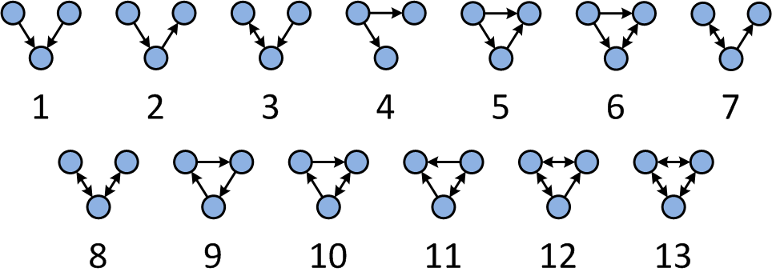

There are 13 possible motifs on three nodes. I computed how many times each of these 
motifs appears in the project networks. Because
each network has different size, the counts were normalized with respect to the total number
of motifs in each network. The following bar plot compares average frequencies of all the motifs.

#### Average motif profiles on 3 nodes in C# and F# projects
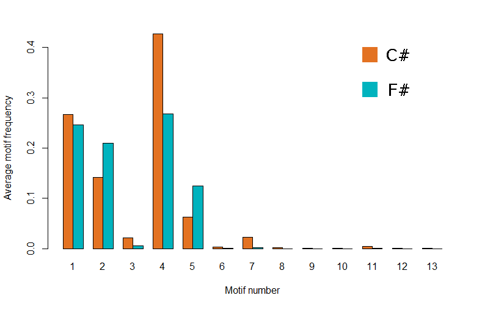

Motifs number 1, 2, 4 and 5 are the most common in both C# and F# projects. 
They seem to differ only in how often each motif appears. The results seem 
quite intuitive because these motifs look like standard patterns that
would be expected in a software project.
The bar plot shows only the average frequencies
and variance between individual projects is quite high. 
Summary of results for each project is available [here](https://github.com/evelinag/Projects/blob/master/CodeNetworks/code/data/motifs_3nodes.csv).

#### Motifs that are C#-specific

What is interesting is that there are several motifs that appear in 
many C# projects but they are not in any of the analyzed F# projects.
Here they are: 

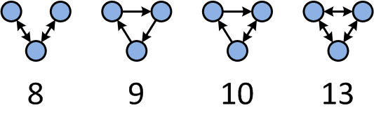

Additionally motif number 12 appears just once in `FSharp.Core` and nowhere else
among the F# projects. 
What all these motifs have in common is that they all contain 
cyclic dependencies. Scott Wlaschin wrote
a nice blog post on why [cyclic dependencies are evil](http://fsharpforfunandprofit.com/posts/cyclic-dependencies/). 
Simply said, they add complexity, mess up structure of code
and complicate maintainability. 
So, this is how the evil cyclic dependencies look in real-world projects. 
Especially motif number 13 with full connectivity looks like 
something that should be avoided. How frequent are these cyclic motifs?

| Motif | Number of projects |
|-------|:------------------:|
8 | 13
9 | 9
10 | 14
13 | 4

The table shows how many projects contain each of the C#-specific motifs. 
Motifs number 8 and 10 are in majority of the analysed networks which means they are
quite widespread. Fortunately, the most entagled motif number 13 is the least common one and
occurs only in 4 projects. There are no motifs that would appear only in F# projects. 

### Motifs on 4 nodes

I will not give the full analysis of motifs on 4 nodes because there are 199
of them. However, there are a few interesting things to point out. Again, F# and C# share
the most common motifs which look like patterns that we would expect to see:

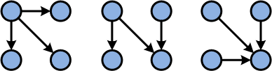

And again, we have some motifs that appear exclusively in C# projects, this time we have 129
motifs that are C#-only. There are no motifs that would be just in F# projects. 
These are the most common C#-specific ones:

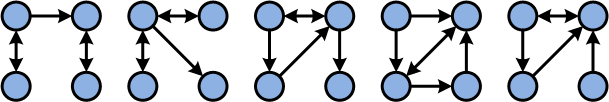

These motifs are also quite widespread.  
The first one appears in 14 projects, the rest of them in 13 projects.
Finally, what about the most complex motif on 4 nodes?

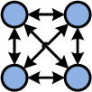

It turns out that this motif appears in 3 of the C# projects (specifically in EntityFramework, 
Mono.Cecil and Newtonsoft.Json). This pattern looks like quite a poor design choice. 

Explore motifs in your projects
---------------------------------------

If you want to find what is the motif profile of your own project, [this FsLab Journal](/data/2014/journal-networks/analyseCodeNetworks.html) shows how to run the analysis. Source code from the Journal is available [here](https://github.com/evelinag/Projects/tree/master/CodeNetworks/networksJournal). You can also download the full source code that replicates results from this blog post from my [GitHub page](https://github.com/evelinag/Projects/tree/master/CodeNetworks/code).

Summary
------------------------------

In this blog post, I looked at dependency networks in several 
C# and F# projects. The analysis shows some similarities and differences
between the two programming languages. In general, C# projects tend 
to be larger, with more classes and dependencies. They also have
longer chains of dependencies on average. Real world F# projects
are smaller with cleaner modularity.

I also described recurring patterns (motifs) that appear in dependency networks. 
The most common motifs are similar in C# and F# projects. However, most of C# 
projects contain motifs with complicated cyclic dependencies that do not appear
in F# at all. Cyclic dependencies in general complicate the code and obscure
dependency structure. 

This analysis is still very limited. For example we can debate if  
the dependency networks are well defined with respect to both languages
to be truly comparable. Nevertheless, it seems that this type of analysis 
can reveal some aspects of dependency networks.

In general, it seems that most C# projects would be harder to maintain because of all the
cyclic dependencies and more complex structure overall. The question is whether
it is a feature of the language itself that encourages programmers 
to create more complex systems. 

I also presented a poster on this topic at 
[Cambridge Networks Day 2014](http://www.cnn.group.cam.ac.uk/cambridge-networks-day).

<iframe src="http://wl.figshare.com/articles/1036337/embed?show_title=1"  frameborder="0"></iframe>

Correction 13/6/2014: Relation between number of nodes and number of links is a power law function.

