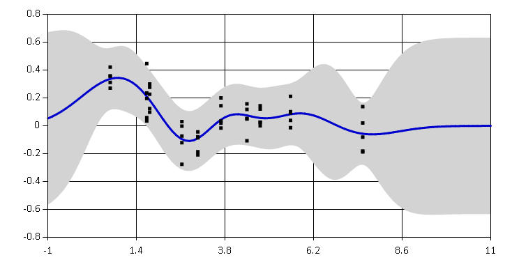
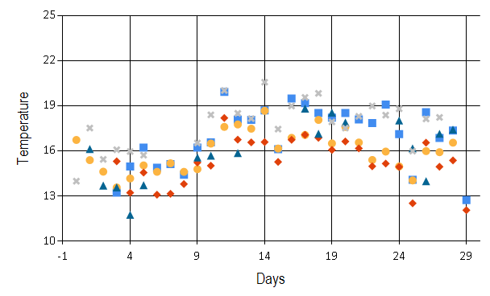
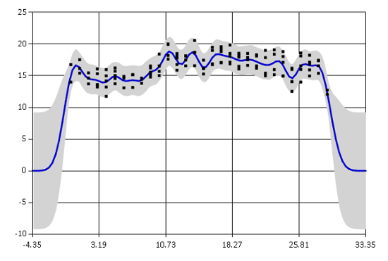
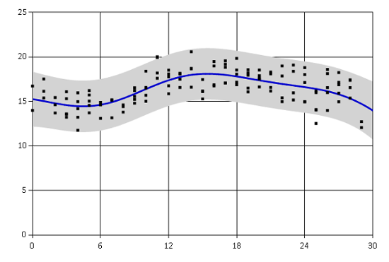
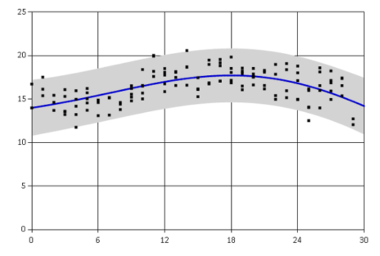

For my academic research, I recently wrote a library in F# for 
fitting basic Gaussian process
regression that I used to model time-series gene expression data. 
I am releasing the code publicly as an 
[Ariadne package](http://evelinag.com/Ariadne).
In its current state, you can use the library to model various time-series
data.

<!-- more -->

Gaussian processes are probabilistic models for random functions. 
[Ariadne package](http://evelinag.com/Ariadne)
implements basic Gaussian processes for supervised nonlinear regression. 

In general, Gaussian processes are used to model functions $ f : X \rightarrow Y$
when we have noisy observations of function values $y_i$ at locations $x_i$

$$
(x_1, y_1), \dots, (x_n, y_n), 
$$
$$y_i 
= f(x_i) + \epsilon_i, \text{ where } \epsilon_i \sim \mathcal{N}(0, \sigma^{2})
$$

I will not go into theoretical explanations about Gaussian processes, there
are other sources for [that](http://www.gaussianprocess.org/gpml/). Instead, 
I will introduce an example of Gaussian processes in action. 
In the rest of this blog post, I use Ariadne to model weather data.

Example: modelling temperature measurements
---------------------------------
Let's say I want to know how the weather was over the last couple of weeks in Cambridge (UK). 
Of course, I can download historical data from the [Open Weather Map](http://openweathermap.org/)
and analyze them. But what if I do not trust the summary data they provide
for specific cities? I want to go to the source and download actual data measured at individual weather
stations. If I download historical data from several different locations
around Cambridge, I should be able to integrate the data together.

Here, I will show a few code snippets, you can find the complete script with 
commentary [here](/data/2014/journal-ariadne/WeatherData.html). 

I downloaded temperatures (in Celsius) from 5 weather stations that all lie approximately
within 15 mile radius from the centre
of Cambridge. The data show average temperature for every day over the past month.
This is how they look:


> data;;
val it : Observation<float> [] = 
	[|{Locations =
		[|3.0; 4.0; 5.0; 6.0; 7.0; 8.0; 9.0; 10.0; 11.0; 12.0; 13.0; 14.0; 15.0;
			16.0; 17.0; 18.0; 19.0; 20.0; 21.0; 22.0; 23.0; 24.0; 25.0; 26.0; 27.0;
			28.0; 29.0|];
		Observations =
		[|13.23; 14.98; 16.23; 14.9; 15.14; 14.42; 16.23; 16.58; 19.94; 18.09;
			18.08; 18.7; 16.12; 19.49; 19.18; 18.53; 18.22; 18.53; 18.1; 17.86;
			19.09; 17.13; 14.09; 18.59; 16.87; 17.37; 12.74|];};
	{Locations =
		[|0.0; 1.0; 2.0; 3.0; 4.0; 5.0; 6.0; 7.0; 8.0; 9.0; 10.0; 11.0; 12.0;
			13.0; 14.0; 15.0; 16.0; 17.0; 18.0; 19.0; 20.0; 21.0; 22.0; 23.0; 24.0;
			25.0; 26.0; 27.0; 28.0|];
		Observations =
		[|16.74; 15.4; 14.63; 13.58; 14.18; 15.05; 14.62; 15.19; 14.62; 14.8;
			16.5; 17.61; 17.77; 17.49; 18.68; 16.17; 16.88; 17.07; 18.07; 16.51;
			17.61; 16.57; 15.41; 15.97; 14.98; 14.05; 16.0; 15.93; 16.56|];};
	{Locations =
		[|3.0; 4.0; 5.0; 6.0; 7.0; 8.0; 9.0; 10.0; 11.0; 12.0; 13.0; 14.0; 15.0;
			16.0; 17.0; 18.0; 19.0; 20.0; 21.0; 22.0; 23.0; 24.0; 25.0; 26.0; 27.0;
			28.0; 29.0|];
		Observations =
		[|15.32; 13.23; 14.57; 13.1; 13.16; 13.81; 15.24; 15.03; 18.2; 16.76;
			16.58; 16.6; 15.28; 16.75; 17.08; 16.88; 16.08; 16.64; 16.18; 14.99;
			15.17; 14.95; 12.53; 16.56; 14.96; 15.38; 12.07|];};
	{Locations =
		[|1.0; 2.0; 3.0; 4.0; 5.0; 9.0; 10.0; 12.0; 17.0; 18.0; 19.0; 20.0; 24.0;
			25.0; 26.0; 27.0; 28.0|];
		Observations =
		[|16.14; 13.71; 13.59; 11.76; 13.73; 15.57; 15.7; 15.87; 18.83; 17.16;
			18.56; 17.9; 18.03; 16.18; 14.0; 17.15; 17.43|];};
	{Locations =
		[|0.0; 1.0; 2.0; 3.0; 4.0; 5.0; 9.0; 10.0; 11.0; 12.0; 13.0; 14.0; 15.0;
			16.0; 17.0; 18.0; 19.0; 20.0; 21.0; 22.0; 23.0; 24.0; 25.0; 26.0; 27.0|];
		Observations =
		[|14.0; 17.53; 15.45; 16.09; 15.97; 15.73; 16.54; 18.41; 20.03; 18.51;
			18.16; 20.58; 17.46; 19.0; 19.57; 19.84; 17.94; 17.53; 18.31; 19.0;
			18.39; 18.81; 16.0; 18.14; 18.24|];} |]
				

The locations are in days from the beginning of my observations, different markers 
correspond to individual weather stations.
Notice that the data are quite noisy. Also, we have different number of observations in 
different days. Sometimes there are 5 observations, sometimes only 2, sometimes there are
outliers. Gaussian processes are a great tool to model this form of data because they take
all the noise and uncertainty into account. 

Now we can construct a model for the observed data -
 a Gaussian process with squared exponential covariance function. The covariance
 function (also called kernel) specifies a form of function that we are modelling.
Squared exponential kernel generally characterizes very smooth functions. 


#r "Ariadne.dll"
open Ariadne.GaussianProcess
open Ariadne.Kernels

// Covariance hyperparameters
let lengthscale = 1.0
let signalVariance = 20.0
let noiseVariance = 1.0

// Covariance function
let sqExp = SquaredExp.SquaredExp(lengthscale, signalVariance, noiseVariance)


I initially guessed some values for hyperparameters of the squared exponential covariance function. 
The first hyperparameter is the lengthscale. Its value regulates how quickly the function
values change, how wide squiggles we expect to see in the function. Lengthscale of 1
assumes that the temperature changes quite quickly from day to day.
 
The second parameter is the signal variance which regulates how far does the function
go from its prior mean. Since the prior mean function of our Gaussian process is zero
and I am being lazy by leaving the data on their original temperature scale, I have to set quite a 
large variance. The last parameter is the noise variance which models the amount of 
noise present in the observed data. 
You can find more details on interpretation
of each hyperparameter in the [documentation](http://evelinag.com/Ariadne/covarianceFunctions.html).

With hyperparameters prepared, we can finally fit the Gaussian process regression model.


let gp = sqExp.GaussianProcess()
gp |> plot data
	

The graph shows the mean estimated temperature as a blue line. The grey region
corresponds to a 95% confidence interval. The fit is not very bad, the confidence
interval includes most of the observed data and the mean captures the general trend.
You can see that the function goes to zero rapidly outside of the observed region.
This is because the Gaussian process prediction reverts to the prior mean value 
when there are no observations. Note that the confidence interval is also getting much
wider in that area. Generally we can reliably extrapolate only about
one lengthscale outside of the data regions.

Optimizing hyperparameters
-----------------------------

Guessing values hyperparameters is not a very reliable method of fitting a model. Ariadne
provides two basic methods for [optimizing hyperparameters](http://evelinag.com/Ariadne/optimization.html):

 * Metropolis-Hastings posterior sampling
 * simple gradient descent

Both methods are optimizing the log likelihood of hyperparameters given
observed data.
The first method, Metropolis-Hastings, is a probabilistic method which gives us
the mean estimate of the posterior distribution of hyperparameters, given observations and our
prior beliefs about hyperparameter values. This is a proper Bayesian method 
for optimizing hyperparameters. 

First we need to set prior distributions for each hyperparameter. Here I am using
a Log-normal prior because all hyperparamters have to be larger than zero. The prior
distributions are centred around my initial guessed values.


let rnd = System.Random(0)
let lengthscalePrior = Distributions.LogNormal.WithMeanVariance(1.0, 1.0, rnd)
let variancePrior = Distributions.LogNormal.WithMeanVariance(20.0, 5.0, rnd)
let noisePrior = Distributions.LogNormal.WithMeanVariance(0.5, 1.0, rnd)
let prior = SquaredExp.Prior(lengthscalePrior, variancePrior, noisePrior)


Now we set parameters of the Metropolis-Hastings sampler. 


open Ariadne.Optimization.MetropolisHastings
let settings = 
	{ Burnin = 500		 // Number of burn-in iterations
		Lag = 5            // Thinning of posterior samples
		SampleSize = 100 } // Number of thinned posterior samples


And finally we can run the sampler and create a Gaussian process with the 
optimized covariance function (kernel).


let kernelMH = SquaredExp.optimizeMetropolis data settings prior sqExp
let gpMH = kernelMH.GaussianProcess()

// Compare log likelihoods
printfn "Original Gaussian process likelihood: %f" (gp.LogLikelihood data)
printfn "MH Gaussian process likelihood: %f" (gpMH.LogLikelihood data)


	Original Gaussian process likelihood: -333.369341
	MH Gaussian process likelihood: -246.435036

Log likelihood of the new Gaussian process increased quite significantly, which means
that the optimized Gaussian process provides a much better fit to the observed training
data than the original one.

Another method to select values of hyperparameters is to use some 
algorithm for standard nonlinear optimization.
Ariadne currently implements only basic gradient descent algorithm. This method uses
derivatives of the log likelihood function to find a local optimum.


let gdSettings = 
	{ GradientDescent.Iterations = 1000; 
		GradientDescent.StepSize = 0.1}
let gradientFunction parameters = SquaredExp.fullGradient data parameters

let kernelGD = 
	gradientDescent gradientFunction gdSettings (sqExp.Parameters)
	|> SquaredExp.ofParameters

let gpGD = kernelGD.GaussianProcess()
printfn "Original Gaussian process likelihood: %f" (gp.LogLikelihood data)
printfn "GD Gaussian process likelihood: %f" (gpGD.LogLikelihood data)


	Original Gaussian process likelihood: -333.369341
	GD Gaussian process likelihood: -241.782424

Gradient descent found different optimum than Metropolis-Hastings. The fit seems to capture
mainly the overall trend in the temperatures over the whole month.

The two methods generally yield different resulting models. 
Metropolis-Hastings takes into account our prior beliefs about hyperparameter values
and it also samples from the true posterior. On the other hand, gradient descent 
finds only a single local maximum of the nonlinear log likelihood function.

Summary
---------------

It seems that conclusion of this little temperature analysis 
is that beginning of September was generally quite warm in Cambridge but
the temperatures are probably slowly beginning to drop.
This does not sound very surprising! However, we did it by summarizing noisy 
data with missing values, coming from five different weather stations. By using
Gaussian processes, we also directly get error bars for our regression estimates.

This blog post includes only snippets of the whole data analysis. You can find
the complete F# script in 
[this FsLab Journal](/data/2014/journal-ariadne/WeatherData.html).
More information on how to use Ariadne, such as how to compute predictions for 
unobserved data, are available on the [project website](http://evelinag.com/Ariadne).
The library is in a very early stage and I will be happy for any feedback or suggestions.

Links
--------------------------------

* [Ariadne project](http://evelinag.com/Ariadne) website with documentation.

* Library source code on [GitHub](https://github.com/evelinag/Ariadne).

  You can download the source code for weather analysis from 
  [GitHub](https://github.com/evelinag/Projects/tree/master/WeatherData).
