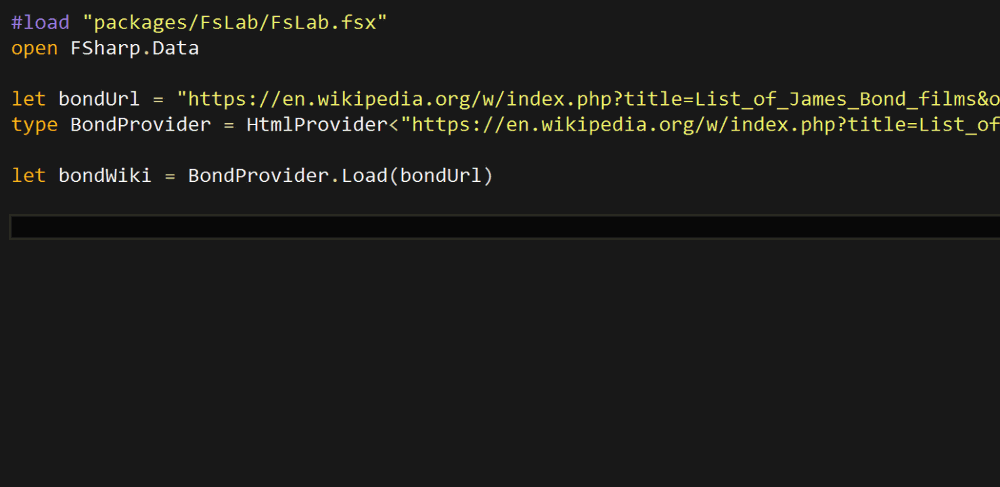
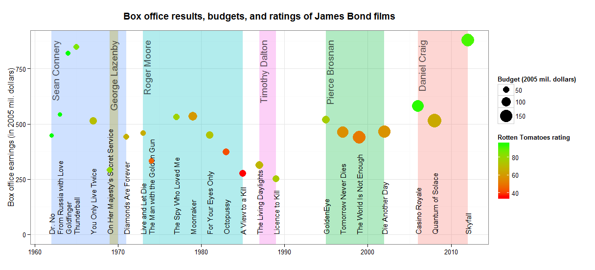

Earlier this week I read an interesting article on visualizing box office success of 
James Bond films using R and ggplot2 by Christoph Safferling (
you can find it [here](http://opiateforthemass.es/articles/james-bond-film-ratings/)).
The blog post shows how to pull information from Wikipedia and visualize 
the budget, box office and rating of each film - all this using R. 
While reading the blog post, I couldn't help wondering how would a similar 
analysis look in F# using the HTML type provider from the
[F# Data](http://fsharp.github.io/FSharp.Data/index.html) library. 

<!-- more -->

I was looking for a good excuse to play with the HTML type provider for some time so I decided
to replicate the analysis. And since I saw the 
latest James Bond film Spectre recently, I was also curious how do the individual films differ 
from each other quantitatively. 

The original [blog post](http://opiateforthemass.es/articles/james-bond-film-ratings/) 
looks at how does the box office success of each film compare to its aggregated rating from 
Rotten Tomatoes. All the data are available on Wikipedia in a single 
[article](https://en.wikipedia.org/w/index.php?title=List_of_James_Bond_films&oldid=688916363), so 
all that is needed is to download the data, clean them and visualize them.

## Accessing data with HTML type provider

To download the data from Wikipedia, the original blog post used `rvest` package in R. As I'm using
the HTML type provider in F# to do the same task, the first step is to use the URL of the article
to initialize the type provider. The type provider
then looks at the website and generates statically typed access to all the tables that appear on that website:


#load "packages/FsLab/FsLab.fsx"
open FSharp.Data
open XPlot.GoogleCharts

let bondUrl = "https://en.wikipedia.org/w/index.php?title=List_of_James_Bond_films&oldid=688916363"
type BondProvider = HtmlProvider<(*[omit:(...)]*)"https://en.wikipedia.org/w/index.php?title=List_of_James_Bond_films&oldid=688916363"(*[/omit]*)>

let bondWiki = BondProvider.Load(bondUrl) 


Accessing the actual data from the Wikipedia article was so quick and easy that I had to create a gif to 
show explicitly how nice and straightforward it is:

One of the main advantages of the HTML type provider is that we can access the tables on the website using
their original headings. The original R version of the code accesses the tables using the
order in which the tables appear on the website so we would need to know the index of the correct table. 

When accessing individual items in the table, we can similarly see all the labels from the table's header and 
directly access all the elements in each row. No need to parse or clean the data manually.

Using the type provider, I pulled the following information about each film: the title, year, the actor, the budget and 
the box office. Both the budet and the box office are adjusted to the equivalent of 2005 
prices to make them comparable between different years. 
Again, the type provider does most of the parsing, except for a few tweaks that the original Wikipedia 
table used to make alphabetic sorting of items in the table easier. Because of this, I had to manually 
adjust some of titles and names of the actors.


let boxOffice = 
	let allBoxOffice = 
		[| for row in bondWiki.Tables.``Box office``.Rows ->
			row.Title, row.Year, row.Budget2, 
			row.``Box office 2``, row.``Bond actor`` |]
	allBoxOffice.[1..allBoxOffice.Length-3]
	|> Array.map (fun (titleRaw, yr, bdgt, bo, actorRaw) -> 
		let actor = actorRaw.[actorRaw.Length/2 + 1 .. ]
		let title = 
			match titleRaw |> Seq.tryFindIndex ((=) '!') with
			| Some(idx) -> titleRaw.[idx+1 ..]
			| None -> titleRaw
		title, int yr, float bdgt, float bo, actor)
		

To keep things simple, I returned all the values as a simple array of tuples containing all the relevant 
information. This could be modified to a proper data frame using [Deedle](http://bluemountaincapital.github.io/Deedle/). 

As the next step, I downloaded the Rotten tomatoes ratings, which are placed in a different table called 
"Reception and accolades" on the same Wikipedia page:


let rating = 
	let allRatings = 
		[| for row in bondWiki.Tables.``Reception and accolades``.Rows ->
			row.Film, row.``Rotten Tomatoes`` |]
	allRatings.[0..allRatings.Length-2]
	|> Array.map (fun (title, r) -> 
		title, r.[0..r.IndexOf('%')-1] |> float )
		

Here I had to strip off some additional information like the percent sign and the total number
of reviews that Wikipedia added into each cell of the table.

## Visualization

Now we are ready to do some charting. I'm using the [XPlot](https://tahahachana.github.io/XPlot/) library 
which provides a nice API for Google Charts (and also plot.ly). To follow the visualization used in the original
blog post, I decided to create a bubble chart. This type of plot in Google Charts 
takes up to four parameters for each data point:
to define its horizontal and vertical position in the plot, and to specify the colour and size of each bubble. 


let options =
	Options(
		title = "Bond fims - rating and box office",
		hAxis = Axis(title = "Year"),
		vAxis = Axis(title = "Box office (millions $)"),
		bubble = Bubble(textStyle=TextStyle(color="transparent")),
		colors = [| "red"; "gold" |] )

Array.map2 (fun (title, yr, bdgt, bo, actor) (_, rt) -> 
				title + " (" + actor + ")", yr, bo, rt, bdgt ) boxOffice rating
|> Chart.Bubble
|> Chart.WithLabels(["Title"; "Year"; "Box office"; "Rating"; "Budget"])
|> Chart.WithOptions(options)


In the resulting plot, the x axis represents the year and the y axis shows the box office success. 
The size of each bubble represents the budget of each film, and finally the colours show the Rotten Tomatoes
rating where lighter colours mean higher rating. Also, hover over the individual bubbles to see all the 
information about the films including their title and the James Bond actors. 

This plot shows that the first few James Bond films with Sean Connery were very successfull, 
with small budgets, high aggregated rating and growing revenues. The revenue was gradually decreasing
over the Roger Moore and Timothy Dalton era. The box office again improved after 1995 with Pierce
Brosnan, and the budgets increased as well. Two of the most recent films with Daniel Craig, Casino
Royal and Skyfall, also reached similarly high aggregated ratings as some of the older Sean Connery films. 
Unfortunately, there are no available data on Spectre at the moment so we don't know how does it
compare to the previous films. 

From the source code perspective, this all took about 45 lines of F# code, 
compared to 125 lines of R code that were used in the original blog 
post to produce a similar bubble chart with ggplot2 
([see the original R code](https://github.com/safferli/james_bond_films/blob/master/007.R)). 
The difference in 
size is mainly because the R code parses all the data in the Wikipedia table manually to create a 
clean data frame. In F#, the HTML type provider already does most of the work that is required to get
the data into a usable shape. 

I also tried to replicate the resulting ggplot figure from the original blog post to test the capabilities 
of the F# [RPRovider](http://bluemountaincapital.github.io/FSharpRProvider/), which is a mechanism of 
accessing functions from R within F#. Using ggplot2 from F# with RProvider is a little more verbose than in 
R, but the full F# code still came out shorter than the the full R code (125 lines in F# compared to 187 lines in R). 
The code I used to generate the bubble chart and the full ggplot2 chart is available as a 
[gist](https://gist.github.com/evelinag/0ce68655f2aae1ecabcb).

## Summary 

Overall, I was very happy with the whole F# HTML type provider experience. It allows accessing most of the
elements from the webpage using their real human-readable names and it does a great job parsing the data from 
the tables. Compared to the R version, there is less work left to be done to get the data into a good
shape and prepare it for visualisation. 

Finally, here is the source code that I used and some other relevant links:

* [Source code](https://gist.github.com/evelinag/0ce68655f2aae1ecabcb)
* This blog post uses FsLab, you can download a template [here](http://fslab.org/download/)
* [Blog post that inspired all this](http://opiateforthemass.es/articles/james-bond-film-ratings/)

