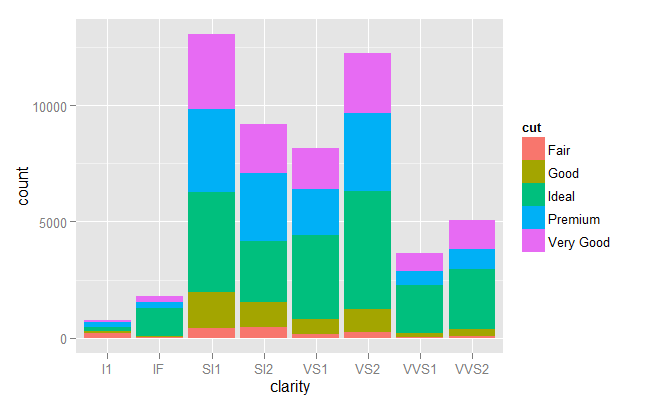
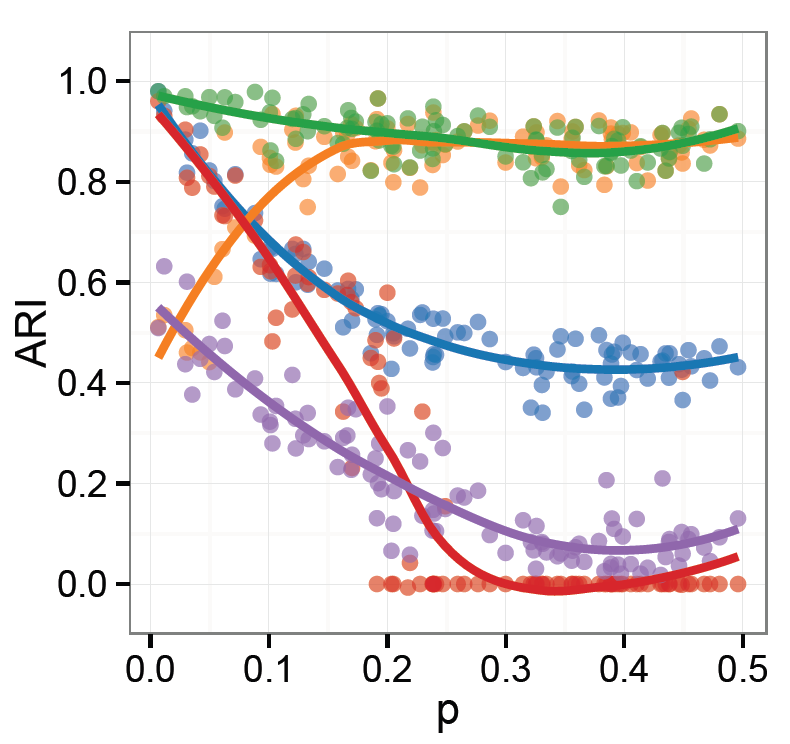
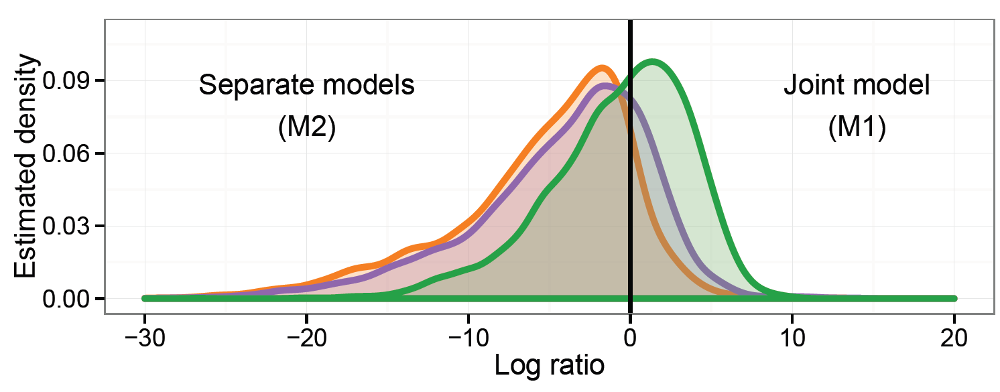
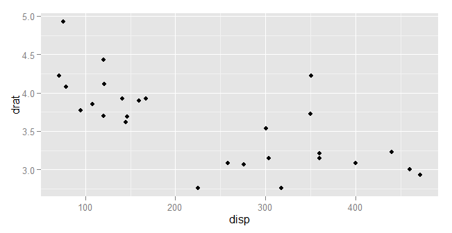
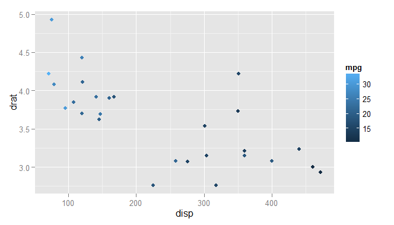
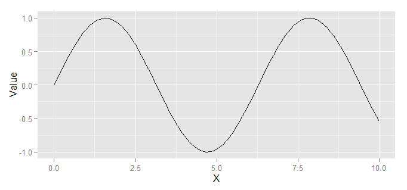
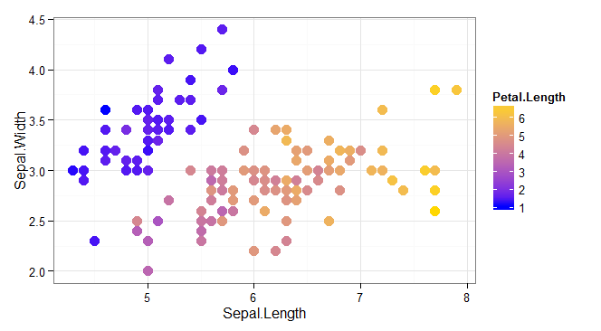

In my previous [blog post](http://evelinag.com/blog/2015/11-18-f-tackles-james-bond/index.html)
I visualized data on James Bond films both with Google Charts and with ggplot2.
Because I skipped the code relating to ggplot2, here I'd like to 
look in detail at how to use ggplot2 from F#. 

Currently
[ggplot2](http://ggplot2.org/) is my go-to visualization library (unless
I need to embed a plot - check out the James Bond bubble chart!). 
Here I summarize some of my experiences with using ggplot2 from F# through the RProvider. 
I also put together
a [simple wrapper]((https://github.com/evelinag/ffplot)) around the most common 
ggplot2 functions to simplify the usage.

<!-- more -->

<figure class="image container is-fluid">

</figure>

[Ggplot2](http://ggplot2.org/) is a plotting library developed for 
the [R](https://www.r-project.org/) environment. 
The library uses a compositional approach to plots where the
result is composed of graphical elements, each adding a specific data or visualization 
layer. This may sound complicated - but for simple cases
ggplot2 has easy to use functions with sensible defaults. 
For more complex layered plots, it allows customizing almost every aspect. 
The flexibility of ggplot2 is great
but what makes it truly usable is that it comes with a good 
[documentation](http://docs.ggplot2.org/current/).

As an example of some more complex and customized plots that I created using ggplot2 recently, 
below are two plots I used in my PhD thesis. 

In F#, in principle we can call any R function through the 
[RProvider](http://bluemountaincapital.github.io/FSharpRProvider/).
Unfortunately, using ggplot2 with RProvider can be rather verbose and cumbersome. 
I'll illustrate
some of the issues in the next section and then I'll introduce the F# wrapper, 
[ffplot](https://github.com/evelinag/ffplot).

## Using ggplot2 directly

Inside R, creating a simple plot is relatively straightforward. In the code sample
below I first open the necessary packages. Then I load an example
dataset - the `mtcars` data frame which describes several properties of 32 cars tested
in the 70's by the *Motor Trend* magazine. 
After loading the data, I initialize the ggplot with the dataset and define
a so-called aesthetic mapping in the `aes` function. 
The mapping relates the data to visual 
elements or properties: in this case the x axis is defined
by the `disp` column of the `mtc` data frame, and the y axis is defined by the `drat` column. 
Then I choose an appropriate visualization method, in this case it's `geom_point` that creates
a scatter plot combining the data frame with the aesthetic mapping.


library(ggplot2)
library(datasets)
mtc = mtcars
ggplot(mtc, aes(x=disp, y=drat)) + 
	geom_point()
	

Moving into F#, we can call ggplot2 directly like any other R function. 
Like in R, here I also first open the neccessary libraries and
then load the `mtcars` dataset. Here I transform the `mtcars` values into a 
[Deedle](http://bluemountaincapital.github.io/Deedle/) data frame, which is a
direct equivalent of the R data frame:


// load general environment
#load "packages/FsLab/FsLab.fsx"
open RProvider
open RProvider.ggplot2
open Deedle

// load example datasets from R 
open RProvider.datasets	
let mtc = R.mtcars.GetValue<Frame<string, string>>()


Before I create the plot itself, I introduce a custom operator for the ggplot2 plot composition
that is done in R with the `+` operator. In 
F#, the operator is available through RProvider as a function `R.``+``(_,_)`.
Instead of using it directly, we can call it through the following operator: 


let (++) (plot1:RDotNet.SymbolicExpression) (plot2:RDotNet.SymbolicExpression) = 
	R.``+``(plot1, plot2) 
	

Now we can finally re-create the same plot within F#. 
Unfortunately, the simple R code turns into a much longer function call:


R.ggplot(
	namedParams[
		"data", box mtc; 
		"mapping", box (
			R.aes__string(x="disp", y="drat"))])
++ R.geom__point()


This is because the `ggplot` function is extremely flexible and accepts any number of
parameters. This may be OK in R, but it complicates the usage from F#. 
First, we have to specify names for all arguments that we pass 
into `ggplot`, which is done through the `namedParams` function from RProvider. 
Second, we have to identify
columns in the dataframe through their names specified as strings - and we do that
using the R function `aes_string`. This is because F# represents data frames differently 
from R.

## Using ffplot to simplify calling ggplot2

The F# code sample is quite verbose which doesn't do ggplot2 any justice. 
 I put together a simple wrapper, the ffplot, to simplify some of the common scenarios of calling ggplot2. 
You can find the wrapper [here on Github](https://github.com/evelinag/ffplot).
With ffplot, the ggplot2 example turns into almost a direct copy of the original R
code:


#load "ggplot.fs"
open ggplot

G.ggplot(mtc, G.aes(x="disp", y="drat"))
++ R.geom__point()


We can also use the wrapper to add colour specification - 
here the points are coloured based 
on the values in the `mpg` column:


G.ggplot(mtc, G.aes(x="disp", y="drat", colour="mpg"))
++ R.geom__point()


So far all the examples were using a Deedle data frame (created from an R 
data frame). But the usage is not limited to that, we can also use our
own data. The only important thing is that ggplot2 is built
around data frames which means that we have to transform any data 
into an R data frame before we can visualize them. 

The code snipped below
creates a simple dataset and transforms it into an R data frame with
two columns named "X" and "Value". Then we call the `ggplot` function
to visualize the plot, using the column names in the aesthetic mapping. 


let x = [0.0 .. 0.1 .. 10.0]
let y = x |> List.map (fun value -> sin(value))

// create a data frame
let dataframe = 
	namedParams ["X", x; "Value", y] 
	|> R.data_frame

G.ggplot(dataframe, G.aes(x="X", y="Value"))
++ R.geom__line()


At the moment, the `G.aes` function accepts only a few aesthetics
: the `x` and `y` values, and the `colour` and `fill` values that
specify optional colour mappings for the visualizations. If you would like to
add more, please send a pull request! 

Here I shown some simple usage of [ffplot](https://github.com/evelinag/ffplot)
and ggplot2 together in F#. In the Github repository I also included
the [`examples.fsx` file](https://github.com/evelinag/ffplot/blob/master/examples.fsx)
showing more examples of various types of plots - histograms, bar plots,
density plots, and also some more complex plots. 

To use ffplot in your own project, 
 download and reference the [`ggplot.fs`](https://github.com/evelinag/ffplot/blob/master/ggplot.fs)
file from your solution. You can also add the file using the 
[paket dependency manager](http://fsprojects.github.io/Paket/) by adding the following line into 
your `paket.dependencies` file:

	github evelinag/ffplot ggplot.fs

## Using RProvider without FsLab

In the examples above, I was using RProvider as a part of [FsLab](http://fslab.org/), 
a collection of F# data science tools. If you want to use ggplot2 and RProvider directly without
installing other tools, the easiest way is to load the `fsx` file which is 
downloaded as a part of the RProvider package:

	// load RProvider into F# interactive
	#load "packages/RProvider/RProvider.fsx"

This F# scripts loads all the necessary dependencies and adds a printer for 
F# interactive which displays the R plots. 

## Helpful tip

I would like to finish with a simple tip.
When using ggplot2 to create plots for my PhD thesis, I wanted all the plots
to share a similar visual style. I wanted all the plots to have the same theme, 
the same colour scheme
and the same font sizes in titles, axes and legends. All these can be 
of course specified in ggplot2. What I found useful was to create a single
function that specified all the size and theme settings and then apply it to 
every plot that I was generating to keep a uniform visual style. 

This piece of code shows an example of such function that tweaks font sizes in axes, legends 
and titles. Then it's applied to a plot, using the same compositional approach 
as the ggplot2 library. 


let sizeSettings () =
	R.theme(namedParams["axis.text", R.element__text(namedParams["size", 12])])
	++ R.theme(namedParams["legend.text", R.element__text(namedParams["size", 12])])
	++ R.theme(namedParams["axis.title", R.element__text(namedParams["size", 14])])
	++ R.theme(namedParams["plot.title", R.element__text(namedParams["size", 18])])

// apply settings to a plot
G.ggplot(iris, G.aes(x="Sepal.Length", y="Sepal.Width",colour="Petal.Length"))
	++ (*[omit:(...)]*)
			R.geom__point(namedParams["size", 4])
	++ R.theme__bw()
	++ R.scale__color__gradient(
		namedParams["low", "blue"; "high", "gold"])
	++ R.ggtitle("Iris dataset")
	++ R.xlab("Sepal length")
	++ R.ylab("Sepal width")
	(*[/omit]*)
	++ sizeSettings()
	

You can apply the same approach with most charting libraries available in F# 
(such as [XPlot](https://tahahachana.github.io/XPlot/))
because they use functional style that allows applying functions to entire plots. 
But with ggplot2 this makes even more sense. The settings tend to be
verbose and some of them require extensive digging through the documentation. 
By separating them in a dedicated function, they can be reused and applied across
multiple plots of different types to keep the same style.

## Links

* Get [ffplot from Github](https://github.com/evelinag/ffplot).
* [ggplot2 website](http://ggplot2.org/)
* This blog post uses FsLab, you can download a template [here](http://fslab.org/download/). 
* The code for my [James Bond blogpost](evelinag.com/blog/2015/11-18-f-tackles-james-bond/index.html) 
  contains a more complex example of using ggplot2 from F#:
  [source code](https://gist.github.com/evelinag/0ce68655f2aae1ecabcb)

And finally, this is the plot produced by the last code sample:

