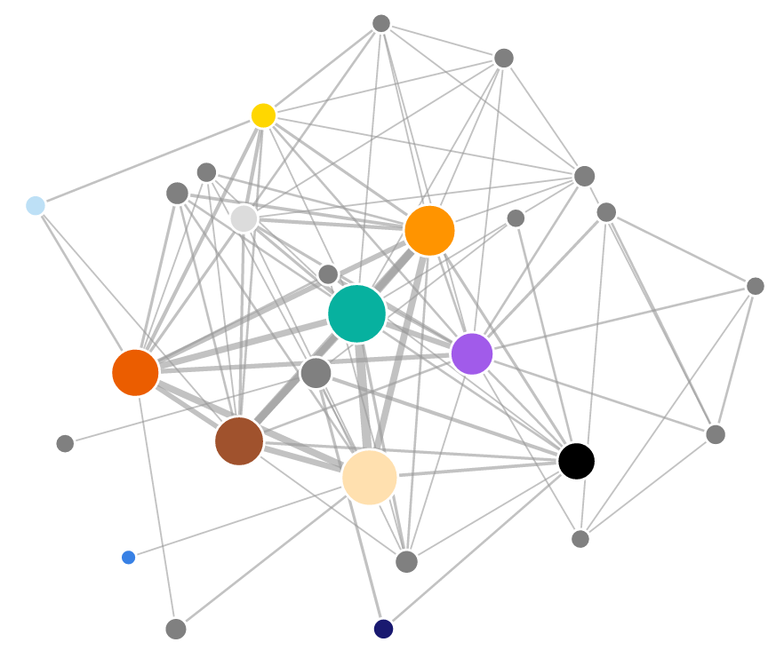
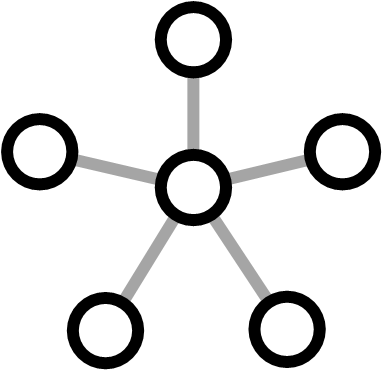
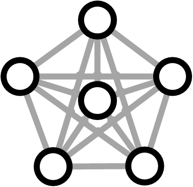

*Warning: contains spoilers*

If you have seen the new addition to the Star Wars franchise - The Force Awakens - you have probably noticed some similarities to the plots of some of the earlier movies, especially Episode IV: A New Hope. Does the similarity in the story translate to similarity in the social network of the new film? I downloaded the movie script, extracted the social network of characters and compared it to the social networks from the earlier movies. 

*[Read my analysis of social networks from Episodes I to VI here.](/blog/2015/12-15-star-wars-social-network/)*

<!-- more -->

<figure class="image container is-fluid">

</figure>

Recently, the script for the new Star Wars movie became available on the
[imsdb](http://www.imsdb.com/scripts/Star-Wars-The-Force-Awakens.html) website. Of course I had to look at it to see how does the social network structure compare to the previous films. If you're interested in the technical details of how I extracted the data with F# and what were some of the new challenges in the new script, see my summary in the <a href="#how">How I did it</a> section. 

If you are asking "Why use F#?", I'll be giving a talk on data science in F# and on how I did the analysis at [fsharpconf](http://fsharpconf.com/), a free online conference on F#. Watch it live on March 4 2016 or catch up with the recording later.

But back to Star Wars! Before we dive into details, here is the full network extracted from all the films together. The universe has grown quite a bit. You can open the network in a full window which will show an interactive visualization of the network where you can drag individual nodes around. If you hover over the individual nodes, you'll see the name of the corresponding character. 

[Open network](/data/2016/social-network-force-awakens/interactions.html)

The network is automatically constructed using the films' screenplays. The nodes in the network represent the individual characters, and they are connected by a link if they both speak within the same scene. The width
of each link represents the frequency of co-occurrence of the two corresponding characters, and the size of each node represents the number of scenes where the character speaks. 

We can see the transition from the prequels towards the new episode, as the network is getting sparser. The new film corresponds to the part of the network on the right and it mostly copies the density of social networks from the original trilogy. The number of nodes is small and they are densely connected. 

Let's look at the structure of the network in the new episode in more detail. As I mentioned, my methodology was to create a link between two characters if they both speak within the same scene. Except there are certain significant scenes where nobody actually speaks. Because of this, I manually added a single link between Rey and Luke. I also decided to add a link between
Rey and Leia although there is no scene where they both speak. I hope these are the only two really significant encounters that happen in silence.

[Open network](/data/2016/social-network-force-awakens/interactions.html)

When you look at the network as a whole, there is a richly connected subnetwork of main characters, accompanied by a network of minor characters, most of which are members of the Resistance. In the bottom right part
of the network there is also a smaller subnetwork of members of the First Order. Because the film parallels Episode IV in many ways, it is only natural to compare the two networks against each other side by side:

<h4> Episode IV: A New Hope </h4>

<h4> Episode VII: The Force Awakens </h4>

Although they are very similar in many ways, the network from Episode VII is still richer than Episode IV. It has more characters overall and weaker connections between some of the main characters. Part of the reason is that the new episode had to incorporate many of the original heroes, as well as introduce the new characters. How does the richer network translate into the underlying social structure? 

### Importance of characters

In my previous analysis of the 6 Star Wars episodes, I looked at two measures of importance of nodes in a network - degree and betweenness. Briefly, degree shows how many connections does each character have in the network, and
centrality indicates how important the character is in connecting the network together (see their explanations [here]("http://evelinag.com/blog/2015/12-15-star-wars-social-network/index.html#centrality)). 

Let's have a look what these two measures say about The Force Awakens network. Would you expect Rey to come at the top? The two tables below show the top five characters according to each of the centrality measures:

<table>
<thead>
<tr class="header">
<th></th>
<th>
Name
</th>
<th>
Degree
</th>
</tr>
</thead>
<tbody>
<tr class="odd">
<td>
1.
</td>
<td>
POE
</td>
<td>
16
</td>
</tr>
<tr class="even">
<td>
2.
</td>
<td>
FINN
</td>
<td>
14
</td>
</tr>
<tr class="odd">
<td>
3.
</td>
<td>
HAN
</td>
<td>
14
</td>
</tr>
<tr class="even">
<td>
4.
</td>
<td>
CHEWBACCA
</td>
<td>
12
</td>
</tr>
<tr class="odd">
<td>
5.
</td>
<td>
BB-8
</td>
<td>
12
</td>
</tr>
</tbody>
</table>

<table>
<thead>
<tr class="header">
<th></th>
<th>
Name
</th>
<th>
Betweenness
</th>
</tr>
</thead>
<tbody>
<tr class="odd">
<td>
1.
</td>
<td>
KYLO REN
</td>
<td>
35.5
</td>
</tr>
<tr class="even">
<td>
2.
</td>
<td>
POE
</td>
<td>
20.3
</td>
</tr>
<tr class="odd">
<td>
3.
</td>
<td>
FINN
</td>
<td>
14.0
</td>
</tr>
<tr class="even">
<td>
4.
</td>
<td>
HAN
</td>
<td>
14.0
</td>
</tr>
<tr class="odd">
<td>
5.
</td>
<td>
REY
</td>
<td>
13.5
</td>
</tr>
</tbody>
</table>

That's an unexpected result, isn't it? The most connected character is Poe, partly because he talks with all the other characters including all the Resistance pilots. Han and Finn come on the second and third place, 
each with 14 connections. Overall, Rey appears on the ninth place with 10 connections. The relatively low degree centrality of Rey is caused by the fact that there are no scenes where she would talk to any of the members of the Resistance, while the other characters (including Finn or BB-8) interact with all the people there. 

When we look at the betweenness of the characters, Kylo Ren comes at the top. The reason for this is that for most characters, he's the closest node connecting them with the First Order's Snoke, General Hux and others. 
Because he spoke to most of the central characters, including Rey, Poe, Finn and Han, he is the most important node linking them to the other parts of the network. The second most 'between' character is Poe, again because
he talks both to Kylo Ren and to many of the Resistance pilots and commanders. 

The betweenness results also make sense from the point of the storyline. Kylo Ren is the person that binds together the world of the original trilogy with the new episode. He's connected to the original characters by being the son of Han and Leia, and he's also interacting with everyone in the new generation of heroes and villains. Based on betweenness, Rey comes in the fifth place. I'm curious to see if this will change when we find out more about Rey's backstory.

Compared to the original trilogy where Luke always comes out at the top based on all measures, the structure of the new film is considerably different and decentralized. Where Luke was the main hero, solely connecting all the parts of the storyline, Rey acts only in some parts of the story. 
In Episode IV, Luke meets both with the other main characters (Han Solo, Chewbacca, Leia) and with members of the Rebel Alliance when he becomes one 
of the pilots and then destroys the Death Star. Rey on the other hand never gets to meet Poe Dameron or other members of the Resistance on screen. Finn 
serves as a more central character to the network than Rey by connecting the different environments. 

### Comparing the network structure

We looked at the individual characters in the social network of The Force Awakens, but how does it compare with the previous movies in terms of network structure? The chart below shows the number of characters in each of the films. It includes only the characters that speak in the script, have specific names (I excluded characters called "PILOT" or even "STAR DESTROYER TECHNICIAN"), and who also speak in at least two scenes. As mentioned in my previous blog post, I also manually added Chewbacca and the robots, 
who are central characters but they don't explicitly speak in any of the scripts. 

The number of distinct characters is going steadily down from Episode I to Episode VI, but the new Episode VII changes the trend quite significantly. The reason for this is probably that it includes some of the original heroes as well as introduces new ones. 

#### Network density

The next plot shows the density of networks from each episode. The density is a ratio that compares how many links are present in the graph with how many potential links there can be theoretically. If the network is 100%
dense, then there is a link between every possible pair of nodes. If the network is 0% dense, then there are only isolated nodes without any links between them. 

Episodes I and II have smaller density than all the other episodes. On the other hand, the most dense episode is number VI: The Return of the Jedi, where there very few minor characters. This may also be a side effect of my methodology - I didn't include any of the Ewoks, who are also not represented as speaking characters. Overall, the original trilogy, the new film and also Episode III (which has the best ratings among the prequels by the way) share very similar network densities. The rest of the prequels have smaller density which is related to the much larger number of characters that appear in them.

#### The clustering coefficient

The same trend as in density repeats when we look at another measure of network structure: the *clustering coefficient*, also called the *transitivity* of a network. In general this measure looks if your friends are also friends with each other. 

In context of our Star Wars social network, if Finn interacted both with Rey and Kylo Ren, did Rey and Kylo Ren interact with each other as well? In this case the answer is Yes, but the answer is No for Rey and Poe. They both talked with Finn but they never talked with each other. The clustering coefficient for Finn is then the number of characters he interacted with that also interacted with each other, divided by the total number of connections that are possible between the characters that Finn interacted with. 

The two example graphs below show the two extreme situations - when there are no connections among the other characters, and when there are all the possible connections. These correspond to clustering coefficient that are equal to 0 and 1.

<h4> Clustering coefficient = 0 </h4>

<h4> Clustering coefficient = 1 </h4>

 

If the story follows a group of people who interact with each other within the group, the corresponding network would have a large clustering coefficient. On the other hand, if the story follows a main hero who interacts with many other characters, but the other characters don't interact with each other, the network would have a smaller clustering coefficient. Let's look at how do the different films compare against each other:

Episode I seems to have the lowest clustering value and Episodes II and III are not much better in this aspect. Episodes IV to VII share similar larger clustering values. This measure again shows that Episodes IV to VII mostly follow several main characters that interact with each other but the prequels are more disconnected. It would be interesting to see what does the field of computational literary studies have to say about the relation of story quality and the different network characteristics.

Overall it seems that the new episode is similar to the original trilogy in some aspects (higher density and clustering), and to the prequel trilogy in other aspects (large number of characters and the story doesn't follow a single central character). It indicates that the similarities with Episode IV: A New Hope are mostly on the surface level and they don't directly translate into the social network structure. Despite the larger number of characters the story works better than in the prequels because the higher density and larger clustering keep the structure together. Still, the storyline is more disconnected into the distinct environments (Rey doesn't get to talk to any members of the Resistance etc.). I think in this case the authors are simply using the fact that the storyline and the entire Star Wars universe feel very familiar and therefore there's no need for much exposition to connect the story together.

*The many worlds of Star Wars*

----------------------------------------------

<h1 id="how">How I did the analysis</h1>

As with my [previous blog post](http://evelinag.com/blog/2015/12-15-star-wars-social-network/index.html), I did my analysis in F# with some help from R with the [RProvider](http://bluemountaincapital.github.io/FSharpRProvider/). The updated source code for the full analysis is available [on my GitHub](https://github.com/evelinag/StarWars-social-network). There are some changes from the previous version that I describe in this section. Because I didn't change most of the code, this description is mostly about the new challenges I faced while processing the data rather than about F#. 

### Name conflicts

To my great satisfaction, most of my code for parsing the screenplays worked on the new script as well. It followed similar format to some of the older scripts, with character names in capital letters and in bold. This made them easy to pick using regular expressions. The only hurdle was the fact that the new script seemed to be much more expressive than the older ones, containing many other expressions in both capital and bold that were looking like character names to my script. There were entire sentences in bold capitals - is this a trend where the script shouts out the important parts in case we missed them? From the computational perspective, I removed most of the clutter by not allowing brackets and most punctuation marks within names. I still had to add an explicit rule to exclude false matches like "CONTINUED" that had exactly the same format as the names in the script.

Similarly as in the previous analysis, I had to introduce some re-mapping of  names for characters who appear under multiple names in the story. This time I mapped FN-2187 to Finn and Ben to Kylo Ren. Well, we've seen Ben before as well, haven't we? Obi-Wan was called Ben in the original trilogy. Because now I had multiple characters called Ben, I also changed the `aliases.csv` file to include the temporal information. The original file simply contained a list of alternative names for some of the characters, followed by the unique name that these aliases were mapped to. If you look at [the file now](https://github.com/evelinag/StarWars-social-network/blob/master/data/aliases.csv), it includes also a list of binary indicators, one for each film. If the value is 0, then the mapping doesn't hold for the corresponding episode, otherwise it's active. 
As a side note, it's nice to have a directly interpretable dataset because it makes spotting errors like these easy. 

*Now a little F#-specific technical note:* 
I used the trusty csv type provider to access the data. Unfortunately, at the moment the type provider doesn't allow users to access specific column in a csv file using its index - and I wanted to access the column corresponding to a specific episode to check if an alias is active or not. Because each row in the csv file is returned as a tuple, we can use a method `FSharpValue.GetTupleFields` from `Microsoft.FSharp.Reflection` to extract the individual elements of the tuple in the form of an array. I used this trick in the following piece of code, where I created an episode-specific dictionary for translating between names:


[<Literal>]
let aliasFile = __SOURCE_DIRECTORY__ + "\\data\\aliases.csv"
type Aliases = CsvProvider<aliasFile>

open Microsoft.FSharp.Reflection

/// Dictinary for translating character names between aliases
let aliasDict episodeIdx = 
		Aliases.Load(aliasFile).Rows 
		|> Seq.choose (fun row -> 
			// extract contents of a tuple as an array of obj values
				if (FSharpValue.GetTupleFields(row).[episodeIdx + 2]) :?> bool
				then Some (row.Alias, row.Name)
				else None)
		|> dict

	let aliasesForEpisodes = Array.init scriptUrls.Length aliasDict
		

Then I used different mapping for the individual episodes (the episode indices are zero-based):


> aliasesForEpisodes.[3].["BEN"];;
val it : string = "OBI-WAN"
> aliasesForEpisodes.[6].["BEN"];;
val it : string = "KYLO REN"


Another problem came when I spotted that Mace Windu from the prequels unexpectedly appeared in my extracted social network. This was caused by the fact that the Stormtrooper who calls Finn "Traitor" uses a weapon that's called "MACE" in the script. Because I was scanning the scripts for all mentions of all the characters, Mace Windu sneaked in and I had to filter him out explicitly. 

*The mace-wielding stormtrooper, nicknamed TR-8R ("Traitor").`*

### Limitations of automatic network generation

If you look at my [previous blog post](http://evelinag.com/blog/2015/12-15-star-wars-social-network/index.html#how), I had to deal with characters that do not speak explicitly in the script but they are still very important to the story, namely R2-D2 and Chewbacca. In case of The Force Awakens, I added BB-8 to the list. The approach I chose previously was to use similar characters to estimate a weight to scale number of mentions of the character in the script to get an approximate number of times the characters actually speak. 

Unfortunately, in the new film there are certain important discrepancies - for example Luke Skywalker gets mentioned in the script many times but he doesn't physically appear until the last scene. When I ran my algorithm to impute the missing characters and their interactions into the network, I ended up with links between Luke and BB-8, Luke and Chewbacca, and Luke and R2-D2. There were also spurious links between all the non-speaking characters and Snoke, simply because their names appeared several times together within the same scene and the simple scaling of link weights couldn't eliminate them. 

This led me to slight change in my methodology: I decided to weight links to each person separately. Large weight $w$ for a person means that if the person is mentioned in a scene, then the person likely also speaks with other characters in the scene. On the other hand, Luke was frequently mentioned in many scenes but he didn't appear in any of them, which gave him a very low weight. I used the following equation to compute the interaction weight of each character:

$$
w\_{\text{character}} = \frac{1}{N} \sum\_{\text{link}(\text{character},x)} \frac{\text{link weight}\_{\text{dialogues}}(\text{character}, x)}{\text{link weight}\_{\text{mentions}}(\text{character}, x)} 
$$

where the link weight for dialogues is the number of times the character speaks with $x$, and the link weight for mentions is the number of times the character and $x$ are both mentioned within the same scene. 

For each of the non-speaking characters and every other character, I used the character weight to scale the number of times they were mentioned together within a scene. For example for the link including BB-8, I computed

$$
\text{link weight}\_{\text{dialogues}}(\text{BB-8}, \text{Rey}) = w\_{\text{Rey}} \times \text{link weight}\_{\text{mentions}}(\text{BB-8}, \text{Rey}) 
$$
$$
\text{link weight}\_{\text{dialogues}}(\text{BB-8}, \text{Poe}) = w\_{\text{Poe}} \times \text{link weight}\_{\text{mentions}}(\text{BB-8}, \text{Poe}) 
$$
$$
\dots
$$

This way, I got more reliable link weights for all the non-speaking characters. Unfortunately this still left some spurious links in the data, for example between Chewbacca and Snoke. This was caused by Han talking about Snoke when Chewbacca was around. This led me to creating a filter for the non-speaking characters, where I used a list of similar characters to filter the links. For example, I allowed a link between Chewbacca and another person only if Han had a link with that person as well. This worked fairly well and produced a credible list of interactions for all the missing characters.

Finally, I had a bug in my previous version of the code where I didn't realize that I was adding a link between the non-speaking characters incorrectly and creating it twice. Here, I computed an approximate weight for each missing character using the same equation as above, and used it to scale the number of mentions to get an approximate average number of mutual interactions. The corrected version of all the networks is available [in JSON on my GitHub](https://github.com/evelinag/StarWars-social-network/tree/master/networks). 

As I mentioned in the beginning, there were also some significant *silent* encounters in the film that were significant enough to be included in the social network. I ended up manually adding links between Rey and Luke and Rey and Leia. These are some of the things that are very difficult to extract automatically just from the text.

### Network statistics

I used the R package `igraph` to compute the network characteristics that I analyzed above. The networks themselves were constructed the same way that I described in my previous blog post. Computing the values in R from F# was then just a question of running basic `igraph` functions. Probably the most difficult part of this was how to extract the numerical values from an R object within F#. Because R doesn't have types, we need to run the `GetValue()` method on the R result, and then tell the compiler what type we expect as the return value:


// computing clustering coefficient and density
// and extracting values from R objects in F#
let clust : float = R.transitivity(graph, "undirected").GetValue()
let density : float = R.graph_density(graph).GetValue()


After I computed the statistics for each of the networks, I used Google Charts from [XPlot](https://tahahachana.github.io/XPlot/) to create the graphics. Below is an example showing how to create a bar chart with XPlot, with custom colours and manually specified limits for the horizontal axis. 


// plot network densities with XPlot
open XPlot.GoogleCharts

// set options - graph limits and colour
let options =
		Options(
				title = "Network density",
				hAxis = Axis(title = "Density (%)", 
						viewWindowMode = "explicit", 
						viewWindow = ViewWindow(min = 5, max = 18)),
				colors = [|"#3bc4c4"|]
		)

// create the chart
densities
|> Array.mapi (fun i c -> "Episode " + string (i+1), c * 100.0 )
|> Chart.Bar
|> Chart.WithOptions(options)	
	

# Summary

When I decided to analyze Star Wars: The Force Awakens, I wasn't expecting a lot of new work, maybe apart from tweaking the regular expressions to make them fit the format of the new film. All the rest was already written and it was working well on the previous films... 

After running my previous code on the new film, everything seemed to work fine. But I ended up with a network where one of the most common characters was called "CONTINUED" and BB-8 and Chewbacca had strong links with Luke and Snoke. After that I spent a lot of time fixing the interactions with non-speaking characters and tweaking the parsing of the scripts. In the end, I also had to manually add some of the links to make the social network correspond to what actually happed on the screen. It certainly was a trap!
But again, I made all the source code and the extracted networks available [on my GitHub](https://github.com/evelinag/StarWars-social-network/tree/master/networks) so you can play with them as well. 

## Links

- [fsharpconf](http://fsharpconf.com/) - free virtual F# conference where I'll be talking about the Star Wars analysis and data science in F# in general.
- Source code: [github.com/evelinag/StarWars-social-network](https://github.com/evelinag/StarWars-social-network)
- Extracted networks in JSON format: [github.com/evelinag/StarWars-social-network/tree/master/networks](https://github.com/evelinag/StarWars-social-network/tree/master/networks)
- Screenplays: [imsdb.com](http://www.imsdb.com/)
- [FsLab: F# data science tools](http://fslab.org/)
- [XPlot library](https://tahahachana.github.io/XPlot/) for creating Google Charts in F#

## Citing the dataset

If you use the dataset in your own work, please cite it via [Zenodo](https://zenodo.org/record/1411479):

Evelina Gabasova. (2016). Star Wars social network (Version 1.0.1) [Data set]. Zenodo. http://doi.org/10.5281/zenodo.1411479